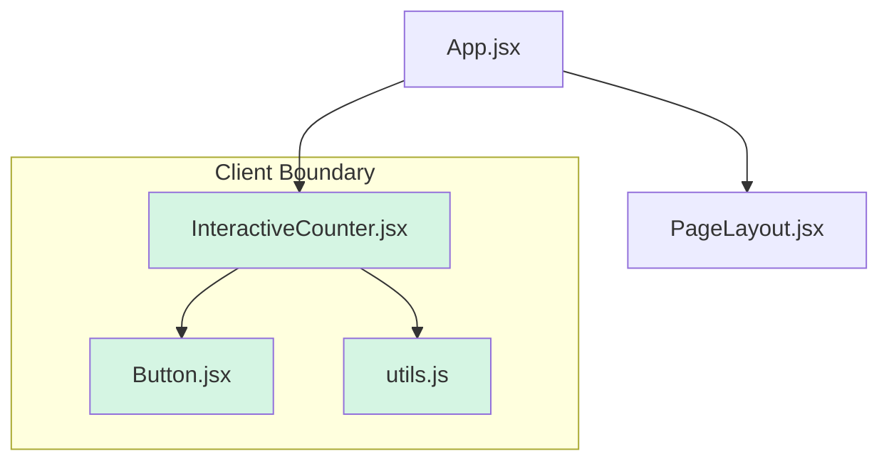

# 2. The `"use client"` Directive: Client Boundary ni Define Cheyadam 💻

React Server Components (RSC) lo, by default, anni components Server Components ye. Ante, avi server lo ne render avtayi. Kani manaki interactivity (button clicks, state changes) kavali ante, aa code ni browser lo run cheyali.

Daanikosam manam `"use client"` directive ni use chestam.

> **`"use client"` anedi oka file top lo pette oka instruction. Idi cheppadam entante: "Ee file and deeniki sambandinchina anni dependencies Client-Side code. Deeni bundle create chesi, browser ki pampinchandi."**

Idi server and client madhya oka clear "boundary" (sarihaddu) ni create chestundi.

### `"use client"` Boundary ela pani chestundi?

React app antha oka module dependency tree (oka file inko file ni import cheskovadam) la untundi.

1.  Oka Server Component file lo, meeru `"use client"` unna file ni import chesarante, aa point deggara bundler oka boundary ni create chestundi.
2.  Aa `"use client"` file, and daani * లోపల* import chesina anni files (daani dependencies) Client Component module graph lo ഭാഗം aipotayi.
3.  Server rendering process lo, React ee client boundary ni chusinappudu, aa component ni render cheyadam aapi, oka placeholder (JSON format lo) pampistundi.
4.  Browser lo, aa placeholder ni chusi, React aa Client Component ni and daani child components ni render chesi, interactive ga chestundi.

**Visualize cheddam:**

Imagine mana app lo ee files unnayi:
-   `App.jsx` (Server Component)
-   `PageLayout.jsx` (Server Component)
-   `InteractiveCounter.jsx` (ee file lo `"use client"` undi)
-   `Button.jsx` (`InteractiveCounter` deeni import chestundi)
-   `utils.js` (`InteractiveCounter` deeni import chestundi)

Ee module graph lo, `InteractiveCounter.jsx` deggara client boundary start avthundi.


Ikkada, `InteractiveCounter.jsx`, `Button.jsx`, and `utils.js` anni client ki pampabadatayi. `App.jsx` and `PageLayout.jsx` server lo ne untayi.

### Eppudu `"use client"` vadali? 🤔

Meeru oka component lo ee features use chestunnaru ante, daanini Client Component ga marchali:

1.  **Interactivity and Event Listeners:** `onClick`, `onChange`, `onSubmit` lanti event handlers use chestunte.
    ```javascript
    'use client';
    import { useState } from 'react';

    export default function Counter() {
      const [count, setCount] = useState(0);
      return <button onClick={() => setCount(c => c + 1)}>{count}</button>;
    }
    ```

2.  **State and Lifecycle Hooks:** `useState`, `useEffect`, `useReducer`, `useContext` lanti hooks use chestunte. Ee hooks component state ni manage cheyadaniki and client-side effects run cheyadaniki avasaram.

3.  **Browser-only APIs:** `window`, `localStorage`, `document`, `navigator` (e.g., geolocation), `fetch` lanti browser lo matrame unde APIs ni access chestunte. Server lo `window` object undadu!
    ```javascript
    'use client';
    import { useEffect, useState } from 'react';

    export default function ThemeSwitcher() {
        const [theme, setTheme] = useState(() => localStorage.getItem('theme') || 'light');

        useEffect(() => {
            document.body.className = theme;
        }, [theme]);

        // ...
    }
    ```

4.  **Third-party Libraries:** Chala third-party libraries (e.g., charting libraries, animation libraries) internal ga `useState` or browser APIs ni use chestayi. Alanti libraries ni use chese component kuda Client Component avvali.

5.  **Class Components:** Class components state and lifecycle methods ni depend avtayi, so avi kevalam Client Components ga matrame pani chestayi.

**Key Rule of Thumb:** Performance kosam, client boundary ni mee component tree lo వీలైనంత 'deep' (leaf-level) ga pettandi. App antha `"use client"` cheyakandi. Kevalam interactivity avasaram unna chota matrame pettandi. Ee విధంగా, తక్కువ JavaScript browser ki pampabadutundi, and mee app fast ga load avthundi. 🚀