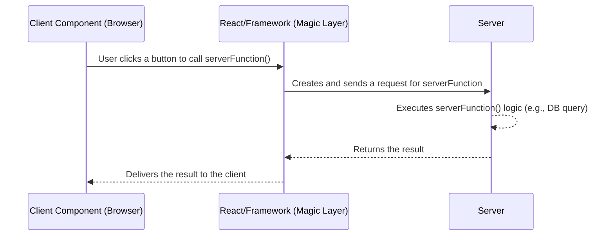

# 1. Server Functions ante enti? 🤔

Namaste friends! 🙏 Mana React Server Components (RSC) journey lo, manam ippudu oka super powerful concept gurinchi nerchukuntunnam: **Server Functions**.

Imagine cheyandi, meeru browser lo (Client Component lo) unnaru, kani server lo unna oka function ni direct ga call cheyali anukuntunaru. Database lo data update cheyadaniki, file save cheyadaniki, or inka ఏదైనా server-side logic run cheyadaniki.

Exactly ee magic cheyadanike Server Functions vachayi! ✨

> **Simple ga cheppalante, Server Functions anevi Client Components nundi direct ga call cheyyagalige asynchronous functions. Ee functions server lo execute avutayi.**

Client nundi server ki network request pampadam, data serialize cheyadam, server lo function ni trigger cheyadam... ee pani antha React and daani framework (like Next.js) chuskuntayi. Manam just function ni call chesthe chalu!

### The Magic Keyword: `"use server"` 🪄

Oka normal JavaScript function ni Server Function ga marchalante, manam cheyalsindalla aa function body lo `"use server";` ane directive ni add cheyadame.

```javascript
async function myServerFunction() {
  "use server"; // Ee line tho, idi Server Function aipotundi!

  // Ikkada server-side logic rastam
  console.log("Hello from the server!");
  const result = await someDatabaseOperation();
  return result;
}
```

Eppudaithe React ee directive ni chustundo, adi automatically ee function ki oka special reference create chestundi. Ee reference ni client component ki pass chesinappudu, client aa function ni call cheyagalgutundi. Behind the scenes, adi server ki oka request pampi, ee function ni execute chestundi.

### Server Function vs. Server Action: Chinna Theda! 🧐

Meeru "Server Actions" ane padam kuda vini untaru. Rendu okate na? Almost!

*   **Server Function:** Idi general term. `"use server"` tho define chesina prathi async function oka Server Function.
*   **Server Action:** Idi oka specific use case. Okavela oka Server Function ni `<form>` loni `action` prop ki pass cheste, or form-related actions kosam use cheste, daanini "Server Action" antaru.

Anukondi, manam oka restaurant ki vellam.
-   Kitchen lo chese anni vantalu **Server Functions**.
-   Customer order chesina vantakam matrame **Server Action**.

> **Mottam meeda, anni Server Actions Server Functions ye, kani anni Server Functions Server Actions kaadu.** Avi data fetch cheyadaniki or vere purposes ki kuda use avvochu.

### Visualize cheddam 🧠

Ee flow ni ardham chesukovadaniki, ee diagram chudandi:



Next, manam ee Server Functions ni ela define cheyali and ela use cheyalo inka detailed ga chuddam!🚀