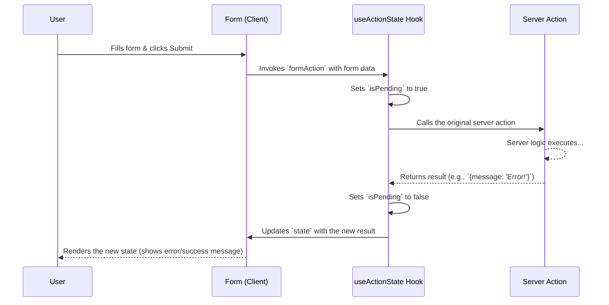

# 3. Forms & State Management tho Server Functions 📝

Client nundi server ki data pampadam lo forms chala important. Server Functions ee process ni incredibly simple and powerful ga chestayi. Manam form submission handle cheyadam, loading states chupinchadam, and server nundi vachina response ni manage cheyadam ela anedi chuddam.

---

### 1. Simple Form Action: Direct ga Pass cheyadam

Ati simple use-case entante, manam create chesina Server Function ni direct ga `<form>` loni `action` prop ki pass cheyadame.

**Ela pani chestundi?**
Form submit chesinappudu, browser automatically form data ni collect chesi, aa data tho manam pass chesina Server Function ni call chestundi. Ee data `FormData` object roopam lo function ki andutundi.

```javascript
// FILE: actions.js
"use server";

export async function createPost(formData) {
  const title = formData.get('title');
  const content = formData.get('content');

  console.log(`Creating post: ${title} - ${content}`);
  // ... database logic ...
  // Form submit ayyaka page re-render avthundi or redirect cheyochu.
}

// FILE: NewPostForm.jsx (Client Component)
"use client";
import { createPost } from './actions';

export default function NewPostForm() {
  return (
    // Server Function ni direct ga action prop ki istunnam
    <form action={createPost}>
      <input type="text" name="title" placeholder="Post Title" />
      <textarea name="content" placeholder="Write your post..."></textarea>
      <button type="submit">Create Post</button>
    </form>
  );
}
```

**Advantage:** Chala clean and simple. Boilerplate code undadu.
**Limitation:** Form submit avutunnapudu user ki "Loading..." lanti feedback chupinchalemu.

---

### 2. Pending State kosam `useTransition`

Form submit cheyadaniki konchem time padite, user ki adi loading state lo undani cheppali. Ledu ante, user button ni malli malli click chese chance undi. Deeni kosam manam `useTransition` hook ni use cheyochu.

**Ela pani chestundi?**
`startTransition` function lo manam server action call ni wrap chestam. `isPending` value manaki transition status (loading or not) ni istundi.

```javascript
// FILE: UpdateUsernameForm.jsx (Client Component)
"use client";
import { useState, useTransition }is 'react';
import { updateUsername } from './actions';

function UpdateUsernameForm() {
  const [isPending, startTransition] = useTransition();

  const handleSubmit = (formData) => {
    startTransition(async () => {
      await updateUsername(formData);
    });
  };

  return (
    <form action={handleSubmit}>
      <input type="text" name="username" />
      <button type="submit" disabled={isPending}>
        {isPending ? 'Updating...' : 'Update'}
      </button>
    </form>
  );
}
```

**Advantage:** User ki clear feedback ivvachu. UI non-blocking ga untundi.
**Limitation:** Server nundi vachina response (e.g., error message) ni easy ga handle cheyalemu.

---

### 3. Complete State Management kosam `useActionState` (The Best Way!) 💪

`useTransition` pending state istundi, kani server nundi vachina data (success message, validation error, etc.) ni ela chupistam? Deenikosam vachina powerful hook ye `useActionState`.

**`useActionState` em istundi?**
1.  `state`: Action nundi return ayina last result/state.
2.  `formAction`: `<form>` ki pass cheyalsina modified action.
3.  `isPending`: Loading state (idi `useTransition` laantide).

**Ela pani chestundi?**
Ee hook oka server function ni, oka initial state ni arugments ga teeskuntundi. Adi manaki state, action, and pending status ni return chestundi.

```javascript
// FILE: actions.js
"use server";
export async function updateUser(prevState, formData) {
    const name = formData.get('name');
    if (name.length < 4) {
        return { message: "Name must be at least 4 characters long.", success: false };
    }
    // ... update logic ...
    return { message: `Successfully updated name to ${name}!`, success: true };
}

// FILE: UserProfile.jsx (Client Component)
"use client";
import { useActionState } from 'react';
import { updateUser } from './actions';

const initialState = { message: null, success: false };

function UserProfile() {
  const [state, formAction, isPending] = useActionState(updateUser, initialState);

  return (
    <form action={formAction}>
      <input type="text" name="name" />
      <button type="submit" disabled={isPending}>
        {isPending ? "Saving..." : "Save"}
      </button>

      {state.message && (
        <p style={{ color: state.success ? 'green' : 'red' }}>
          {state.message}
        </p>
      )}
    </form>
  );
}
```

**Flow ela untundi?**


**Advantage:** Idi complete solution. Pending state, form data, and server response anni oke chota manage cheyochu. Idi "Progressive Enhancement" ki kuda support chestundi.

Next, ee concepts anni use chesi practical code examples chuddam! 🚀