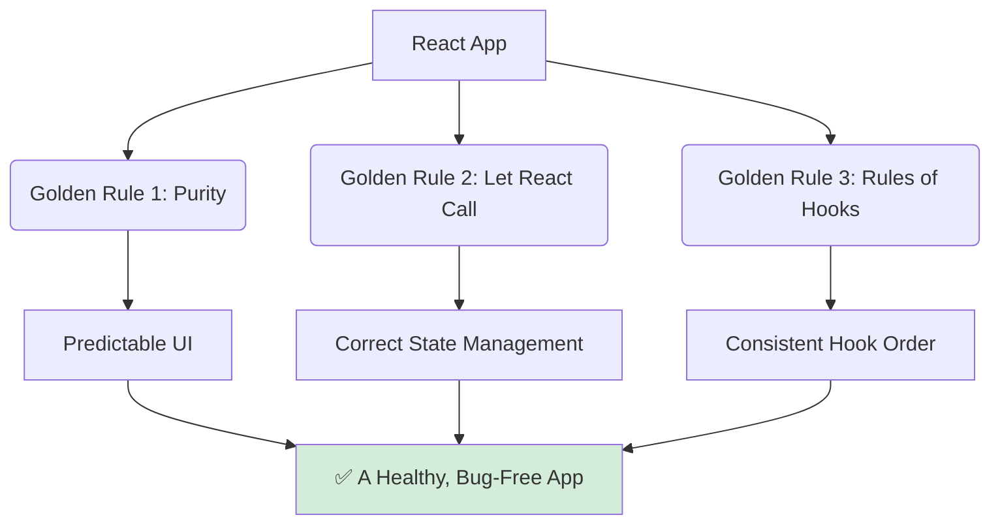

# The Golden Rules of React: The Foundation 🏛️

Hey mawa! Manam ippati varaku chala React features nerchukunnam. Kani, ee features anni correct ga, bug-free ga pani cheyyali ante, manam konni fundamental rules ni follow avvali. Ee rules ni "The Rules of React" antaru.

Eevi just guidelines kaadu, ivi **strict rules**. Veetini break cheste, mee app lo chala weird and unpredictable bugs vasthayi.

Ee rules ni follow avvadam valla, mana code chala predictable ga, easy to understand ga, and maintainable ga untundi. React team and community ee rules ni chala seriously theeskuntaru.

### The Three Golden Rules

React lo manam main ga moodu golden rules ni follow avvali:

1.  **Components and Hooks must be Pure:**
    *   **What it means:** Mee component rendering logic anedi oka pure function la undali. Ante, same input (props, state) isthe, eppudu same output (JSX) ivvali. Rendering time lo, adi bayata prapanchaniki elanti side-effects (e.g., data fetching, DOM manipulation) cheyyakudadu.
    *   **Why it matters:** Ee purity valla ne, React mana app ni safely optimize cheyyagalugutundi and UI eppudu predictable ga untundi.

2.  **React Calls Your Components:**
    *   **What it means:** Manam eppudu mana component functions ni direct ga call cheyyakudadu (e.g., `MyComponent()`). Manam eppudu JSX syntax (`<MyComponent />`) matrame vadali.
    *   **Why it matters:** React ki mana component tree gurinchi full control untundi. Ee control valla ne, adi state, context, and other features ni correct ga manage cheyyagalugutundi.

3.  **The Rules of Hooks:**
    *   **What it means:** Manam `eslint-plugin-react-hooks` chapter lo chusina two main rules:
        1.  Only call Hooks at the top level.
        2.  Only call Hooks from React functions.
    *   **Why it matters:** Ee rules valla, React prathi render lo, Hooks ni correct order lo identify chesi, state ni correctly preserve cheyyagalugutundi.

Ee rules ni enforce cheyadaniki, manam eppudu **`StrictMode`** and **`eslint-plugin-react-hooks`** vadali.

Ippudu, manam prathi rule ni inka deep ga, "why" ane question tho, clear examples tho ardham cheskundam. Let's start with the most important one: Purity. ➡️✨