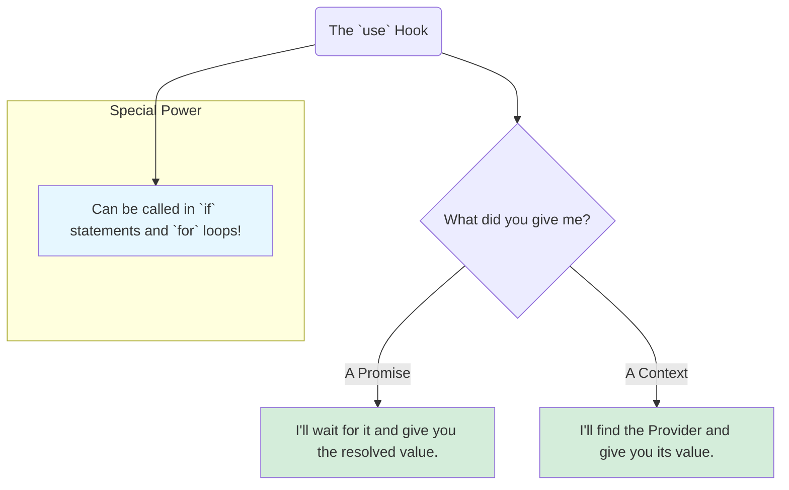

# The `use` Hook: React's New Superpower 🦸‍♂️

Hey friend! Manam ippudu React lo vachina oka kottha and chala powerful hook gurinchi matladukundam: the **`use`** hook.

Ee hook, pata hooks tho polisthe, konni rules ni break chesthundi and manaki kottha superpowers isthundi. It's a game-changer!

## What is `use`?

`use` anedi oka versatile hook. Deeni main pani entante, oka **"resource"** loni value ni "unwrap" chesi, manaki ivvadam.

"Resource" ante enti? Currently, `use` hook rendu rakala resources tho pani chesthundi:
1.  **Promises:** Asynchronous operations (like data fetching) represent chese Promises.
2.  **Context:** `createContext` tho create chesina Context objects.

**Analogy: The Universal Key 🔑**
Imagine, `use` anedi oka universal key lantiది.
*   Daaniki meeru oka locked box (`Promise`) isthe, adi daanini open chesi, loni gift (`resolved value`) ni meeku isthundi. Box inka lock lone unte (promise pending), adi wait chesthundi.
*   Daaniki meeru oka room key (`Context`) isthe, adi aa room (`Provider`) loki velli, aa room lo unna item (`context value`) ni meeku isthundi.

It's a single hook to "read" values from different kinds of sources.

## The Biggest Rule Change Ever!

Pata hooks (`useState`, `useEffect`, `useContext`, etc.) gurinchi manam nerchukunna golden rule enti? **"Don't call Hooks inside loops, conditions, or nested functions."** Avi eppudu component top-level lo ne undali.

The `use` hook **breaks this rule!**

> **You CAN call the `use` hook inside conditionals (like `if`) and loops (like `for`).**

Idi chala pedda change! Deeni valla, manam code ni inka flexible ga and readable ga rayochu. For example:

```jsx
function MyComponent({ shouldGetTheme, themeContext }) {
  let theme = 'default';
  // ✅ This is now possible with the `use` hook!
  if (shouldGetTheme) {
    theme = use(themeContext);
  }
  return <div className={theme}>...</div>;
}
```
`useContext` tho ee pani cheyadam possible kadu.



Ee kottha hook tho manam Promises ni and Context ni ela handle cheyalo, separate ga, clear examples tho next chapters lo chuddam. Get ready to simplify your code! 🚀➡️