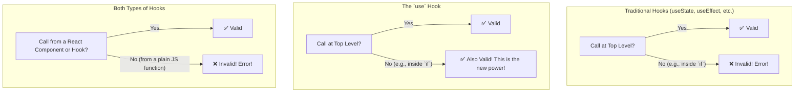

# The New Rules of `use`: Breaking Tradition 🤯

Hey friend, manam React nerchukunnappudu, hooks gurinchi modati nunchi manaki cheppina rendu golden rules unnayi. Ee rules chala strict, and manam vaatini eppudu follow avvali.

### A Quick Recap: The Old "Rules of Hooks"

1.  **Only Call Hooks at the Top Level:** Manam `useState`, `useEffect`, `useContext` lanti hooks ni eppudu component function loni top-level lo ne call cheyyali. Vaatini `if` statements lo, `for` loops lo, or nested functions lo call cheyyakudadu.
2.  **Only Call Hooks from React Functions:** Manam hooks ni kevalam React function components lo or custom hooks lo matrame call cheyyali. Normal JavaScript functions lo vadakudadu.

Ee rules valla, React prathi render lo hooks ni oke order lo call chesi, state ni correct ga maintain cheyagaladhu.

## The `use` Hook: The Rule Breaker!

The new `use` hook comes with a revolutionary change. It follows the second rule, but **it breaks the first rule!**

> **The New Rule:** You **CAN** call `use` inside conditionals (like `if`) and loops (like `for`).

This is a fundamental shift in how we think about hooks. Let's be very clear:

*   `useState`, `useEffect`, `useCallback`, etc. -> **MUST** still follow the old rules. No change there.
*   `use` -> Can be called inside conditions and loops.

### But... One Rule Still Applies!

`use` antha special ayina, adi inka hook eh. So, the second rule still applies to it.

> You **MUST** still call `use` from within a React function component or a custom hook. You cannot call it from a regular JavaScript function.

### Let's Visualize the Rules



**Why is this change so important?**
Ee kottha flexibility valla, manam inka clean and efficient code rayochu. Manaki avasaram lenappudu, manam context ni or promise ni read cheyyakunda skip cheyochu. This leads to better performance and more logical component structures.

For example, a component can now decide whether to read from a theme context based on a prop, without needing complex workarounds.

```jsx
function SmartThemedComponent({ useTheme }) {
  // Ee `use` call anedi `useTheme` prop meeda depend avuthundi.
  // Pata hooks tho idi possible eh kadu!
  const theme = useTheme ? use(ThemeContext) : 'default-theme';

  return <div className={theme}>...</div>
}
```

This concludes our deep dive into the powerful and rule-breaking `use` hook. You now know how to use it with both Promises and Context, and you understand the new flexibility it brings to your components. Happy coding with your new superpower! 💪🚀