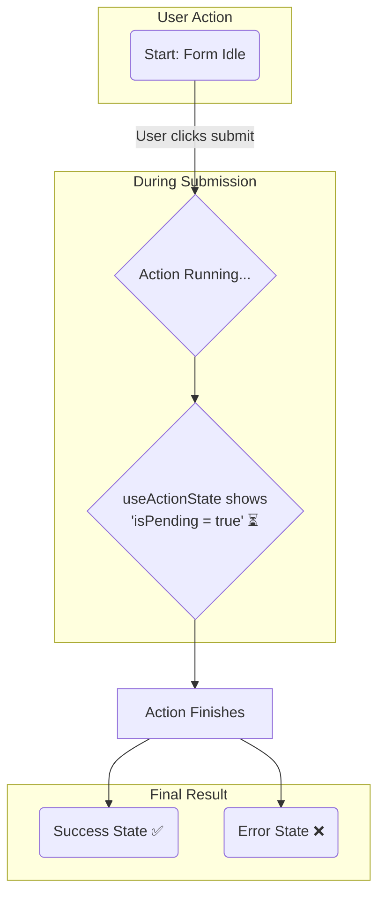

# useActionState: Form States ni Handle Chese Super Hook! 🦸‍♂️

Hey friend! Welcome to our next big topic: `useActionState`. Idi React 19 lo vachina oka kotha and powerful hook.

Manam `useState` gurinchi overview lo chusam, adi component ki "memory" isthundani. `useActionState` kuda state ni handle chesthundi, kani idi specially **form actions** tho pani cheyyadaniki design chesaru.

## Asalu Enduku Ee Kotha Hook? 🤔

Imagine chesko, manam oka login form submit chesthunnam. Em em avuthundi?

1.  User "Login" button click chestadu.
2.  App server ki request pampisthundi. Ee time lo form **"pending"** or **"loading"** state lo untundi. Manam user ki "Loading..." ani chupinchali.
3.  Server nunchi response vasthundi.
    *   Login **success** aithe, manam user ki success message chupinchali or next page ki redirect cheyyali.
    *   Login **fail** aithe, manam "Invalid password" lanti **error message** chupinchali.

Ee states anni (pending, success, error) handle cheyyadaniki, mundu manam `useState` tho paatu inkonni hooks (like `useEffect`, `useTransition`) use chesi chala logic rayalsi vachedi. 🤯

Ee process ni super simple cheyyadanike `useActionState` vachindi!

## `useActionState` Em Chesthundi?

Simple ga cheppalante, **`useActionState` anedi oka form action యొక్క result ni batti state ni update cheyyadaniki help chesthundi.**

Idi manaki form submission life cycle lo unna different states ni easy ga manage chese tools isthundi.

Ee diagram chusava? `useActionState` manaki aa "pending" state (`isPending`) ni and final "success" or "error" state ni automatic ga isthundi. Manam complex logic rayalsina pani ledu.

That's the basic idea! Idi forms tho pani chesetappudu mana life ni chala easy chesthundi.

Next, manam deeni syntax ela untundi and idi manaki em em values isthundo detail ga chuddam. Ready to see the code? Let's go! ➡️