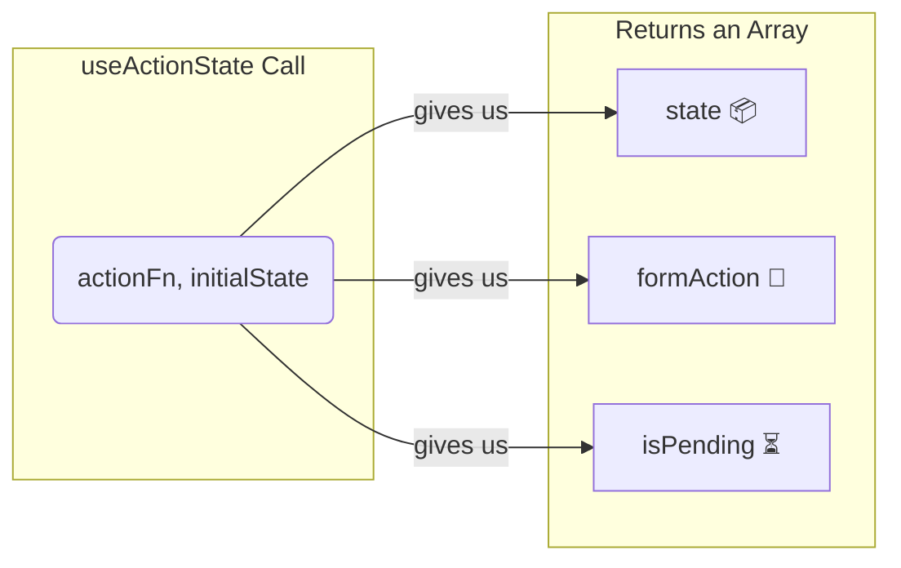

# Deeni Syntax Enti? Idi Manaki Em Isthundi? 🧐

Okay, `useActionState` ento telisindi. Ippudu adi ela pani chesthundo, daani syntax ento chuddam.

## The Basic Syntax

`useActionState` hook ni call chesetappudu, manam daaniki rendu vishayalu pass cheyyali:

1.  **`action` function:** Form submit ainappudu run avvalsina function. Idi normal ga manam server ki data pampadaniki use chestham.
2.  **`initialState`:** Action inka start avvanappudu, state lo em undalo cheppadaniki. Idi `null`, `{ error: null }` lanti object, or edaina avvochu.

Here's how it looks:

```jsx
import { useActionState } from 'react';

async function myAction(previousState, formData) {
  // ... form logic vuntundi ikkada
  // and it returns the new state
}

function MyComponent() {
  const [state, formAction, isPending] = useActionState(myAction, { error: null });

  // ...
}
```

## Idi Manaki Em Return Chesthundi?

`useActionState` manaki oka array lo moodu (3) important values ni isthundi. Manam వాటిని array destructuring tho theeskuntam:

`const [state, formAction, isPending] = useActionState(...)`

Let's look at each one:

### 1. `state`

*   Idi mana form యొక్క current state.
*   **Modati sari render ainappudu,** idi manam pass chesina `initialState` ki equal ga untundi. (e.g., `{ error: null }`).
*   **Action run ayyaka,** idi `myAction` function em *return* chesthundo aa value ki update avuthundi. For example, form submit chesaka error vasthe, mana action `{ error: "Invalid password" }` aney object ni return cheyyochu. Appudu `state` value aa object avuthundi.

### 2. `formAction`

*   Idi oka **kotha action function**. Idi original `myAction` ni wrap chesthundi.
*   Manam ee `formAction` ni mana `<form>` component ki `action` prop ga pass cheyyali.
*   **Important:** Manam original `myAction` ni direct ga form ki ivvakudadu. `useActionState` ichina ee kotha `formAction` ne ivvali. Appude antha magic pani chesthundi! ✨

```jsx
<form action={formAction}>
  {/* ... form inputs ... */}
</form>
```

### 3. `isPending`

*   Idi oka simple boolean (`true` or `false`).
*   Mana `action` function **run అవుతున్నప్పుడు** (ante, server response kosam wait chesthunappudu), `isPending` value `true` ga untundi.
*   Action **complete ayyaka** (success or fail), `isPending` value `false` aipothundi.
*   Deenini use chesi manam user ki "Loading..." lanti messages chupinchadam or submit button ni disable cheyyadam lantiవి cheyyochu. Super useful!

Here's a diagram to remember this:



Anthe! Ippudu manaki `useActionState` యొక్క parts anni telusu.

Next, manam ee `isPending` state ni use chesi oka form submit avuthunnappudu user ki loading feedback ela chupinchalo chuddam. Ready for a real example? Let's go! 🚀