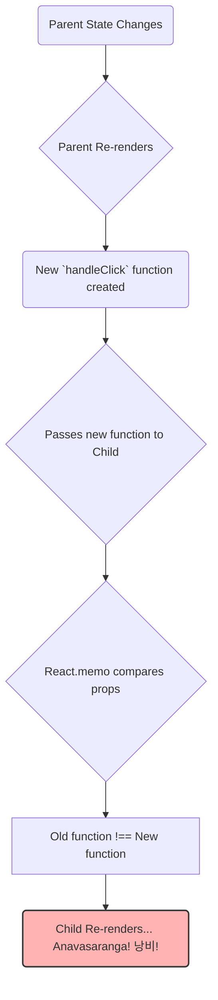

# The Problem: React lo Functions Prathi Sari Kothaga Puttadam! 🤔

Hey friend! Welcome to the `useCallback` chapter. Ee hook performance optimization ki chala important. Kani deenini ardham cheskune mundu, manam oka core problem ni ardham cheskovali.

## JavaScript lo Functions = Objects

First, oka simple JavaScript rule gurthu pettuko: **JavaScript lo functions kuda objects eh!**

Idi enduku important ante, manam `function() {}` or `() => {}` ani rasi prathi sari, JavaScript memory lo oka *kotha* function object ni create chesthundi.

```javascript
const func1 = () => {};
const func2 = () => {};

console.log(func1 === func2); // Returns false! ❌
```

Ee rendu functions chese pani okate aina, avi memory lo veru veru locations lo unna veru veru objects. Anduke `func1 === func2` anedi `false` vasthundi.

## React Component lo Em Avuthundi?

Ippudu deeniki React ki em sambandham?

Oka React component re-render ainappudu, daani body lo unna code antha malli run avuthundi. Ante, aa component lo define chesina prathi function **malli kothaga create avuthundi.**

Let's see an example:

```jsx
function ParentComponent() {
  const [count, setCount] = useState(0);

  // Ee function `ParentComponent` re-render ainappudu alla
  // kothaga create avuthundi.
  const handleClick = () => {
    console.log("Button clicked!");
  };

  return (
    <div>
      <button onClick={() => setCount(count + 1)}>
        Increment Count: {count}
      </button>
      <ChildComponent onClick={handleClick} />
    </div>
  );
}
```

Nuvvu "Increment Count" button click chesinappudu:
1.  `ParentComponent` state maaruthundi.
2.  `ParentComponent` re-render avuthundi.
3.  `handleClick` aney function **malli kothaga create avuthundi.**

## The Real Problem: `React.memo` Break Avvadam

"Okay, kotha function create aithe emayyindi?" anukuntunnava?

Problem `React.memo` use chesinappudu vasthundi. `React.memo` anedi oka component యొక్క props maarithe thappa, daanini re-render cheyyakunda aapesthundi. Idi performance ki chala manchidi.

Kani, manam `ChildComponent` ki `handleClick` function ni prop ga pass chesthunnam.

```jsx
// ChildComponent.jsx
import React from 'react';

const ChildComponent = React.memo(({ onClick }) => {
  console.log("Child Component is re-rendering!");
  return <button onClick={onClick}>Click Me</button>;
});
```

Ippudu flow chudu:
1.  Parent lo count state maarindi.
2.  Parent re-render ayyindi.
3.  `handleClick` aney **kotha** function create ayyindi.
4.  Ee kotha `handleClick` function `ChildComponent` ki prop ga pass chesam.
5.  `React.memo` props ni compare chesthundi. Pata `handleClick` veru, kotha `handleClick` veru (`func1 === func2` is false!).
6.  Props maarinayi anukuni, `React.memo` anavasaranga `ChildComponent` ni **re-render chesthundi!** 😭



Idi chinnaga unna apps lo pedda problem kadu. Kani pedda, complex components unna chota, ee anavasaramaina re-renders app performance ni aadeskuntayi.

So, this is the problem! Manam oka function ni child component ki pass chesthunappudu, adi anavasaramaina re-renders ki cause chesthundi.

Ee problem ni solve cheyyadanike mana hero `useCallback` vachadu! 😎

Next, manam `useCallback` ee problem ni ela solve chesthundo chuddam. Ready for the solution? Let's go! 🚀