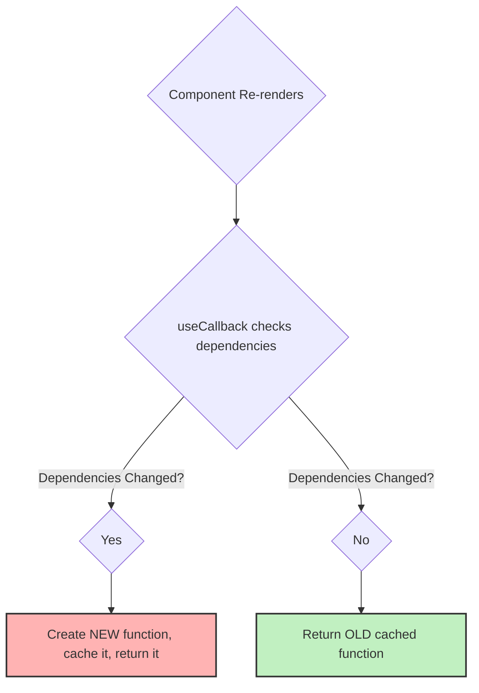

# The Solution: `useCallback` tho Function ni Cache Cheyyadam! 🧠

Manam mundu part lo chusina problem (functions prathi sari kothaga create avvadam) ni solve cheyyadanike `useCallback` undi.

## Asalu `useCallback` ante enti?

`useCallback` anedi oka React Hook. Adi oka function definition ni re-renders madhyalo **cache** cheyyadaniki (or "memoize" cheyyadaniki) help chesthundi.

Ante, `useCallback` tho wrap chesina function, daani dependencies maarithe thappa, prathi re-render lo kothaga create avvadu. React manaki pata function ne malli isthundi.

Simple ga cheppalante: **`useCallback` gives your function a memory.** 💡

## Deeni Syntax Ela Untundi?

`useCallback` hook ki manam rendu arguments pass chestham:

1.  **`fn`:** Manam cache cheyyali anukuntunna function definition.
2.  **`dependencies` array:** Ee function lopaala manam use chese prathi prop or state value ni ee array lo pettali.

```jsx
import { useCallback }_from 'react';

function MyComponent({ prop1, prop2 }) {
  const [state1, setState1] = useState();

  const myCachedFunction = useCallback(() => {
    // Ikkada state1 and prop1 ni use chesthunnam
    console.log(state1, prop1);
  }, [state1, prop1]); // So, వాటిని dependencies array lo pettali

  // ...
}
```

### How does it work?

1.  **First Render:** `MyComponent` render ainappudu, `useCallback` mana function ni theeskuni, daanini cache chesi, manaki return chesthundi.
2.  **Subsequent Renders:** `MyComponent` re-render ainappudu, `useCallback` dependencies array (`[state1, prop1]`) lo unna values ni pata render lo unna values tho compare chesthundi.
    *   **Values Maaraledu:** `state1` and `prop1` values em maaraledu anuko, `useCallback` kotha function ni create cheyyakunda, cache lo unna **pata function ne** malli return chesthundi. ✅
    *   **Values Maarinayi:** `state1` or `prop1` lo edaina value maarindi anuko, `useCallback` appudu mana function ni **kothaga create chesi**, daanini cache chesi, manaki return chesthundi. 🔄

Ee process valla, dependencies maarనంత varaku, mana `myCachedFunction` eppudu oke memory location lo unna oke object ga untundi.



## So, How Does This Solve Our Problem?

Ippudu manam mana pata example ni `useCallback` tho chuddam:

```jsx
function ParentComponent() {
  const [count, setCount] = useState(0);

  // Ee function ippudu `useCallback` tho wrap chesam
  const handleClick = useCallback(() => {
    console.log("Button clicked!");
  }, []); // Dependencies em levu, so empty array

  return (
    <div>
      <button onClick={() => setCount(count + 1)}>
        Increment Count: {count}
      </button>
      <ChildComponent onClick={handleClick} />
    </div>
  );
}
```

Ippudu `ParentComponent` re-render aina kuda, `handleClick` function kothaga create avvadu! Endukante daani dependencies (`[]`) eppudu maaravu. So, `ChildComponent` ki eppudu oke function prop ga velthundi.

`React.memo` ippudu props ni compare chesinappudu, "Oh, `onClick` prop em maaraledu" anukuni, `ChildComponent` ni **re-render cheyyakunda skip chesthundi!** 🎉

Problem solved!

Ippudu `useCallback` enduko, adi ela pani chesthundo neeku ardham ayyindi anukuntunna. Next, manam deenini `React.memo` tho kalipi oka full practical example lo chuddam. Ready to see it in action? Let's go! 🎬 ➡️