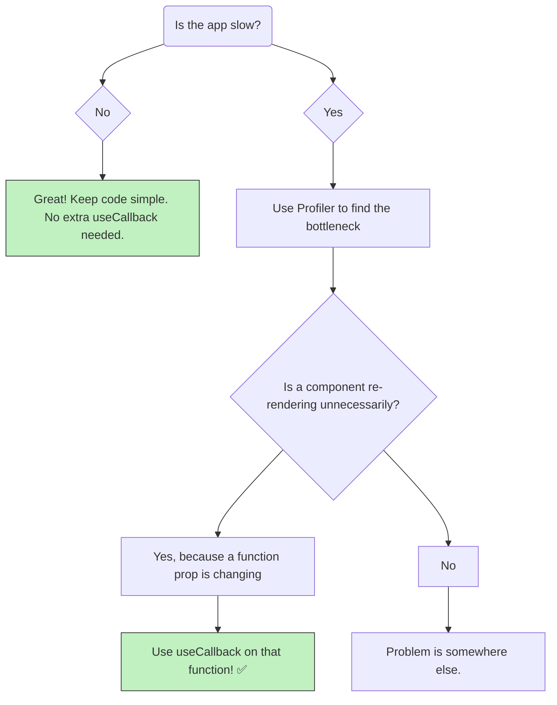

# useCallback ni Eppudu Vadali? (Prathi Function ki Vadala? 🤔)

Manam `useCallback` gurinchi chala nerchukunnam. Ippudu oka million-dollar question: "**Nenu prathi function ni `useCallback` tho wrap cheyyala?**"

Short answer: **Assalu kadu!** ❌

`useCallback` anedi free ga raadu. Adi kuda konchem memory theeskuntundi (function ni cache cheyyadaniki) and konchem work chesthundi (dependencies ni compare cheyyadaniki). So, anavasaranga vadithe, manam performance ni penchadaniki badulu thagginchina vaallam avtham (chala chinna scale lo, kani still).

`useCallback` anedi oka tool. Daanini eppudu vadalo, eppudu vadakudado teliyali.

## Ee Scenarios lo `useCallback` Definite ga Vadali ✅

Basically, moodu (3) main situations lo `useCallback` chala useful.

### 1. `React.memo` unna Component ki Prop ga Pass Chesinappudu

Idi manam already chusina classic case. Nuvvu oka function ni `React.memo` tho wrap chesina child component ki prop ga pass chesthunte, aa function ni `useCallback` tho wrap cheyyadam chala important.

Lekapothe, mana `React.memo` antha waste aipothundi.

```jsx
// Child `ShippingForm` `React.memo` tho wrap cheyyabadindi.
// So, `handleSubmit` ni `useCallback` tho wrap cheyyali.
const handleSubmit = useCallback(() => { ... }, [deps]);

return <ShippingForm onSubmit={handleSubmit} />;
```

### 2. Oka Hook ki Dependency ga Unnappudu

Nuvvu oka function ni `useEffect` lanti inko hook ki dependency ga use chesthunte, aa function ni `useCallback` tho wrap cheyyali.

```jsx
const fetchData = useCallback(() => {
  // ... fetch logic ...
}, [url]);

useEffect(() => {
  fetchData();
}, [fetchData]); // `fetchData` ikkada dependency
```

Lekapothe, parent component re-render ainappudu alla `fetchData` kothaga create avuthundi, and adi `useEffect` ni anavasaranga trigger chesthundi. Idi infinite loops ki kuda dari tiyyochu! Chala jagratha ga undali.

### 3. Custom Hook nunchi Function ni Return Chesinappudu

Nuvvu oka custom hook rastu, daani nunchi oka function ni return chesthunte, aa function ni `useCallback` lo wrap cheyyadam best practice.

```jsx
function useMyCustomHook() {
  // ...
  const myAction = useCallback(() => { ... }, [deps]);

  return { myAction };
}
```

Endukante, nee custom hook ni use chese veroka developer, aa `myAction` function ni dependency ga pettukovalsi ravochu. So, nuvvu daanini stable ga unchithe, వాళ్లకి help chesinattu avuthundi.

## Ee Scenarios lo `useCallback` Avasaram Ledu ❌

*   **Simple Components:** Oka component ki child components levu, or avi `React.memo` use cheyyatledu anuko, akkada `useCallback` avasaram ledu.
*   **During Initial Render:** Component create chesetappudu define chese functions (e.g., event handlers) ki `useCallback` avasaram ledu, unless avi paina cheppina scenarios lo unte.

## The Final Advice: Don't Optimize Prematurely!

Mana app fast ga ne unte, anavasaranga antha `useCallback` tho nimpaku. Code chala complex and unreadable ga aipothundi.

**Golden Rule:**
1.  First, code ni simple ga, readable ga rayi.
2.  Nee app lo edaina part slow ga undi, lag avuthundi anipisthe, appudu **React DevTools Profiler** use cheyyi.
3.  Profiler neeku ekkada problem undo, e components anavasaranga re-render avuthunnayo chupisthundi.
4.  Appudu matrame, aa specific place lo `useCallback` and `React.memo` lanti optimizations use cheyyi.



And that's it for the theory of `useCallback`! Ippudu neeku adi enduku, ela, and eppudu vadalo full clarity vachindi anukuntunna.

Next, manam ee concepts anni kalipi, oka full, runnable code example create cheddam! Ready to build? 💻🔥