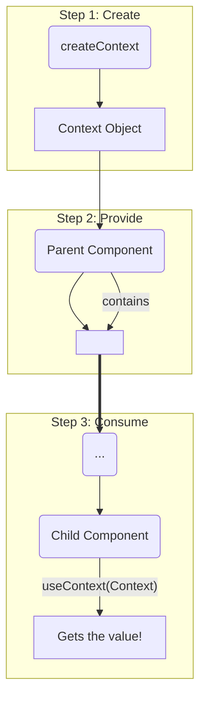

# Context ni Use Cheyyadaniki 3 Simple Steps! 🚶‍♀️🚶‍♂️

Context concept ardham ayyindi. Ippudu daanini mana code lo ela implement cheyyalo chuddam. Idi just oka three-step process anthe. Chala easy!

Let's use our Theme example. Manaki 'dark' or 'light' theme ni app antha share cheyyali.

---

### Step 1: Context ni Create Cheyyadam (`createContext`)

Modati step, manam Context object ni create cheyyali. Deenikosam React manaki `createContext` ane function isthundi.

Ee context ni manam separate file lo create chesi export cheskunte, app antha easy ga import cheskovachu.

```javascript
// ThemeContext.js
import { createContext } from 'react';

// Context ni create chesthunnam.
// 'light' anedi default value. Provider lekapothe, ee value use avuthundi.
export const ThemeContext = createContext('light');
```

*   **`createContext('light')`:** Ikkada manam `ThemeContext` aney oka context object ni create chesthunnam.
*   **`'light'`:** Idi **default value**. Ante, okaవేళ manam Step 2 (Providing) marchipothe, or oka component ee Context Provider bayata unte, `useContext` ee default value ni isthundi. Idi app crash avvakunda kapaduthundi.

---

### Step 2: Context ni Provide Cheyyadam (`<MyContext.Provider>`)

Ippudu manam ee context ni mana component tree ki andinchali ("provide" cheyyali).

Manam `App` component lo `ThemeContext.Provider` tho mana child components ni wrap cheddam.

```jsx
// App.js
import { ThemeContext } from './ThemeContext.js';
import Section from './Section.js';

function App() {
  const [theme, setTheme] = useState('dark');

  return (
    // Step 2.1: Provider tho wrap cheyyali
    <ThemeContext.Provider value={theme}>
      <Section />
    </ThemeContext.Provider>
  );
}
```

*   **`<ThemeContext.Provider>`:** Manam create chesina `ThemeContext` object ki `.Provider` aney oka component untundi.
*   **`value={theme}`:** Idi atni kante important prop. Ikkada manam pass chese value ne, lopaala unna anni components `useContext` tho theeskuntayi. Ikkada manam `'dark'` aney string ni pass chesthunnam.

---

### Step 3: Context ni Consume Cheyyadam (`useContext`)

Final step! Ippudu avasaram unna component lo, manam aa context value ni read ("consume") cheddam. Mana example lo, `Button` component ki aa `theme` value kavali.

```jsx
// Button.js
import { useContext } from 'react';
import { ThemeContext } from './ThemeContext.js';

function Button() {
  // Step 3.1: useContext hook ni call cheyyali
  const theme = useContext(ThemeContext);

  // Ippudu ee 'theme' variable lo 'dark' aney value untundi!
  return <button className={theme}>I am a {theme} button</button>;
}
```

*   **`useContext(ThemeContext)`:** Manam `useContext` hook ki manam create chesina `ThemeContext` object ni pass chestham.
*   **`const theme = ...`:** React ee component nunchi paina unna tree antha vethiki, daggara lo unna `<ThemeContext.Provider>` యొక్క `value` ni theeskuni manaki isthundi.

Anthe! Chusava? Manam `Section` or `Panel` components lo `theme` prop ni pass cheyyalsina avasarame raledu. `Button` component direct ga Context nunchi value ni theeskundi.



Ee three steps tho, manam prop drilling ni completely eliminate chesam. Our code is now much cleaner and easier to maintain.

Ippudu neeku context ni ela vadalo telisindi. Kani... deenini eppudu vadali? Prathi state ki context vadala? Assalu kadu! Next manam deeni gurinchi matladukundam. 🤔➡️