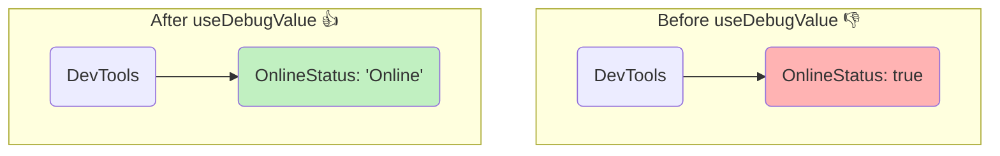

# useDebugValue: Custom Hooks ki Label Ivvadam! 🏷️

Hey friend! Welcome to the `useDebugValue` chapter. Idi manam regular ga application code lo use chese hook kadu. Idi konchem special.

## Evari Kosam Ee Hook? 🤔

Ee hook specially **Custom Hooks raase developers kosam**. Nuvvu `useOnlineStatus`, `useFetchData` lanti nee sonta hooks ni create chesthunte, appudu ee hook neeku chala useful.

Normal application components lo deenini direct ga vadalsina avasaram 99.9% undadu.

## The Problem: Custom Hooks lo Debugging Kashtam

Imagine chesko, nuvvu `useOnlineStatus` aney oka custom hook create chesav. Ee hook user online lo unnado ledo check chesi, `true` or `false` return chesthundi.

```javascript
// A component using your custom hook
function MyComponent() {
  const isOnline = useOnlineStatus();
  // ...
}
```

Ippudu nuvvu `MyComponent` ni **React DevTools** lo inspect chesthav. Appudu neeku Hooks section lo ila kanipisthundi:

`OnlineStatus: true`

"Okay, `true` ante Online anukunta... `false` ante Offline anukunta..." ani nuvvu guess cheyyali. Inko developer nee hook ni use chesthunte, daani internal state `true`/`false` chusi confuse avvochu. Adi antha "readable" ga ledu.

## The Solution: `useDebugValue` tho Clear Labels Ivvadam

Ee problem ni solve cheyyadanike `useDebugValue` undi.

**`useDebugValue` anedi mana custom hook ki React DevTools lo oka manchi, readable label ni add cheyyadaniki help chesthundi.**

Mana `useOnlineStatus` hook lopaala, manam `useDebugValue` ni ila call cheyyochu:

```javascript
// Inside your useOnlineStatus custom hook
import { useDebugValue } from 'react';

function useOnlineStatus() {
  const isOnline = useIsUserOnline(); // some logic

  // THE MAGIC! ✨
  useDebugValue(isOnline ? 'Online' : 'Offline');

  return isOnline;
}
```

Ippudu nuvvu `MyComponent` ni DevTools lo inspect cheste, neeku ila kanipisthundi:

`OnlineStatus: "Online"` ✅

Chusava? `true` ki badulu, ippudu manaki clear ga `"Online"` ane label kanipisthundi. Idi debugging ni chala easy chesthundi, especially nee hook ni vere developers use chesthunappudu.



So, simple ga, ee hook nee custom hooks ni professional ga and easy-to-debug ga cheyyadaniki oka chinna but powerful tool.

Next, manam deeni syntax ento and deenini ela use cheyyalo chuddam. It's very simple! Let's go! ➡️