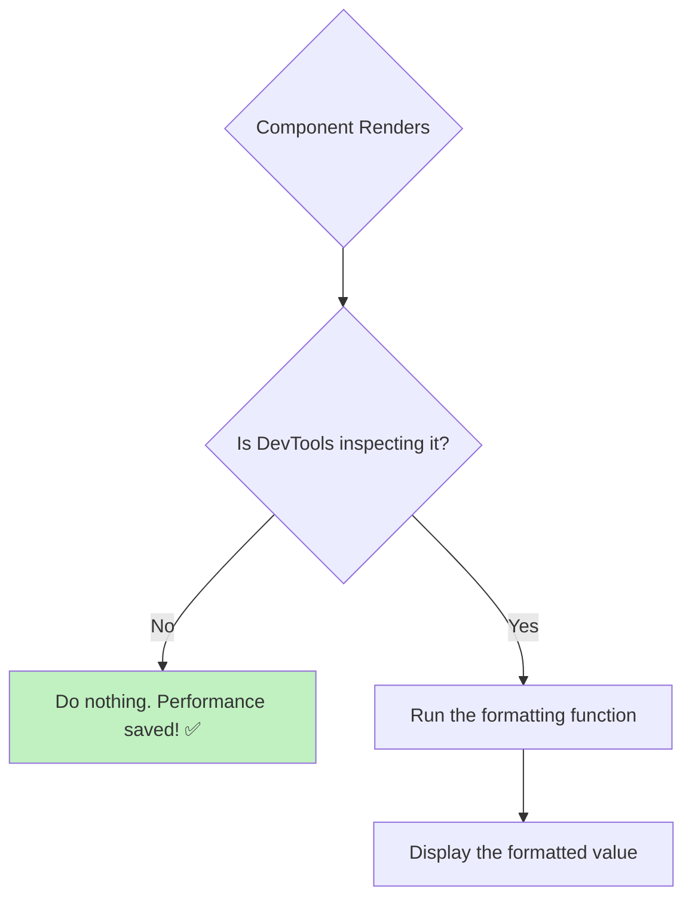

# Performance: Expensive Formatting ni Defer Cheyyadam ⚡️

Manam `useDebugValue` ni ela vadalo chusam. Kani, oka chinna but important vishayam undi: **performance**.

Imagine chesko, nuvvu debug value ga chupinchali anukuntunna data ni format cheyyadaniki chala time paduthundi. For example, oka pedda `Date` object ni manaki ardham ayye `String` ga (`"October 26, 2025"`) marchalante, `toDateString()` lanti function ni call cheyyali.

```javascript
// Inside a custom hook
const [date, setDate] = useState(new Date());

// THE PROBLEM 👎
// Ee `toDateString()` function prathi single re-render lo call avuthundi,
// manam DevTools open chesina, cheyyakapoyina.
// Idi anavasaramaina pani.
useDebugValue(date.toDateString());
```

Ee `date.toDateString()` anedi chinna operation eh, kani ilantivi chala unte or inka complex formatting unte, adi mana app performance ni effect cheyyochu. Manam debugging kosam add chesina feature, app ni slow cheyyakudadu kadha?

## The Solution: Pass a Formatting Function!

Ee problem ni solve cheyyadaniki, `useDebugValue` manaki second (optional) argument theeskuntundi. Adi oka **formatting function**.

```jsx
useDebugValue(value, format?);
```

Ippudu, `useDebugValue` lopaala unna formatting logic, manam component ni **DevTools lo inspect chesinappudu matrame** run avuthundi. Migatha time antha, aa function call avvadu.

Let's fix our date example:

```javascript
// Inside a custom hook
const [date, setDate] = useState(new Date());

// THE SOLUTION 👍
// Ikkada manam second argument ga oka function pass chesthunnam.
// Ee function (d => d.toDateString()) anedi manam DevTools lo
// ee component ni inspect chesinappudu matrame call avuthundi.
useDebugValue(date, d => d.toDateString());
```

**How it works:**
1.  On every render, React just chusthundi, "Okay, `useDebugValue` undi." Anthe.
2.  Nuvvu DevTools open chesi, ee hook unna component ni click chesi inspect chesinappudu...
3.  **Appudu matrame,** React mana formatting function ni theeskuni, daaniki `date` value ni pass chesi (`d => ...`), vachina result (`"October 26, 2025"`) ni display chesthundi.

Ee chinna change tho, manam anavasaramaina work ni chala save cheyyochu.



**Rule of Thumb:** Nee debug value simple string or number aithe, direct ga pass chey. `useDebugValue('Online')`. Kani, konchem formatting or calculation avasaram unte, eppudu second argument ga formatting function ni pass cheyyadam best practice.

And that's everything you need to know about `useDebugValue`! Idi custom hooks raaseటప్పుడు mee development experience ni inka better ga chesthundani aashisthunnanu.

Ee hook ki visible output em undadu kabatti, manam deeniki pedda separate code examples create cheyyalsina avasaram ledu. The concept is the key here.

I hope this was clear. Let's move on to the next hook! 🚀