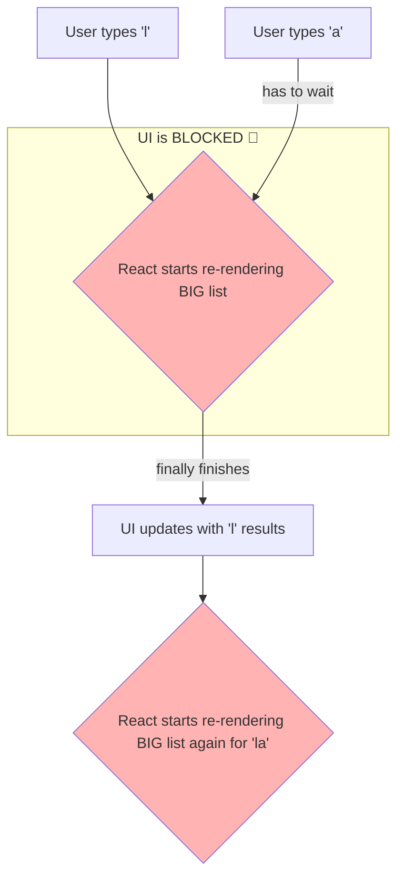

# The Problem: UI "Stuck" Avvadam! (Blocking Renders) 🥶

Hey friend! Manam ippudu inko powerful performance hook gurinchi nerchukuntunnam: `useDeferredValue`.

Deenini ardham cheskodaniki, mundu manam oka common performance problem ni chuddam.

## The Laggy Search Box Scenario

Imagine chesko, nuvvu oka e-commerce website lo unnav. Akkada oka search box undi. Kindha oka 10,000 products unna pedda list undi. Nuvvu search box lo type chese prathi letter ki, aa list filter avvali.

Nuvvu "laptop" ani type cheyyali anukuntunnav.
*   Nuvvu 'l' type cheyagane, React aa 10,000 products ni filter chesi, 'l' unna products ni chupinchali.
*   Nuvvu 'a' type cheyagane, React malli aa list antha filter chesi, 'la' unna products ni chupinchali.
*   And so on...

**The Problem:** Aa 10,000 products ni filter chesi, aa list ni UI lo render cheyyadaniki konchem time paduthundi (e.g., 200 milliseconds). Kani nuvvu chala fast ga type chesthunnav.

Ee situation lo emavuthundi?

1.  Nuvvu 'l' type chesthav. React list ni re-render cheyyadam start chesthundi.
2.  Aa rendering complete avvaka mundhe, nuvvu 'a' type chesthav.
3.  Kani React inka pata rendering tho busy ga undi! So, nee 'a' aney letter input box lo kanipinchadaniki konchem wait cheyyali.
4.  The UI feels **"stuck"** or **"janky"**. Nee typing ki, screen meeda kanipinchadaniki madhyalo oka chinna delay vasthundi.

Ee experience user ki chala frustrating ga untundi. App slow ga undi aney feeling vasthundi.

Ee diagram lo chusava? User input (typing) anedi high-priority. Adi ventane kanipinchali. Kani, list ni update cheyyadam anedi konchem slow ga jarigina parvaledu.

Kani, normal ga React lo, anni updates ki oke priority untundi. So, slow render (the list) valla fast update (the input) block avuthundi.

Ee "UI blocking" problem ni solve cheyyadanike, React manaki `useDeferredValue` aney oka amazing tool ichindi.

Next, manam `useDeferredValue` ee problem ni ela solve chesthundo, UI ni "non-blocking" ga ela chesthundo chuddam. Ready to make our UI super responsive? Let's go! 🚀➡️