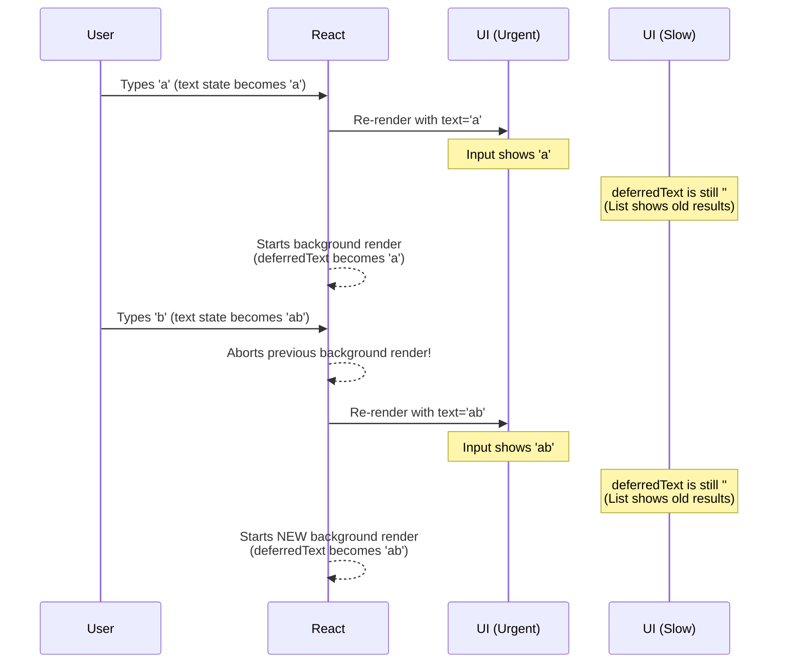

# `useDeferredValue` ni Ela Vadali? (The Syntax) 🤓

Okay, manam `useDeferredValue` aney concept ni ardham cheskunnam. Ippudu daani syntax ento, adi ela use cheyyalo chuddam. The best part is, it's incredibly simple!

## The Basic Syntax

`useDeferredValue` anedi oka function, daaniki manam oka argument pass chestham.

`const deferredValue = useDeferredValue(value);`

*   **`value`:** Idi nuvvu defer cheyyali anukuntunna value. Idi oka state variable avvochu, oka prop avvochu, edaina avvochu.
*   **`deferredValue`:** Idi `useDeferredValue` manaki return chese kotha value. Idi mana original `value` యొక్క "deferred" (or "low priority") version anamata.

Anthe! Chala simple kadha?

## `deferredValue` యొక్క Behaviour

Ikkade konchem tricky part undi. `deferredValue` eppudu `value` tho equal ga undadu. Adi konchem "lag" avuthundi.

Let's see the timeline:

1.  **Initial Render:** Modati sari component render ainappudu, `deferredValue` anedi `value` tho a समानంగా untundi. No lag.

2.  **When `value` changes:** `value` (e.g., `text` state) maarindi anuko, React ventane oka re-render ni start chesthundi. Ee re-render lo:
    *   `value` anedi kotha value ni chupisthundi (e.g., `'hello'`).
    *   `deferredValue` inka **pata value ne** chupisthundi (e.g., `'hell'`).

3.  **Background Render:** Aa modati re-render complete ayipoyaka, React ventane background lo inko re-render ni start chesthundi. Ee background render lo, `deferredValue` kuda kotha value (`'hello'`) ki update avuthundi.

Ee process valla, urgent UI parts (like input fields) ventane update avuthayi, and slow UI parts (like a long list) konchem aagi, background lo update avuthayi.



## An Important Rule ☝️

Nuvvu `useDeferredValue` ki pass chese value, state or prop lanti stable value ayyi undali. Prathi render lo kotha object ni create chesi, daanini `useDeferredValue` ki pass cheyyakudadu.

```jsx
// ❌ BAD: This will cause infinite background renders!
const deferredValue = useDeferredValue({ a: 1 });

// ✅ GOOD: Pass a state variable or a prop
const [value, setValue] = useState({ a: 1 });
const deferredValue = useDeferredValue(value);
```

Ippudu manaki deferred value ni ela theeskovalo telisindi. Kani, list lo pata results kanipisthunnappudu, user ki adi "stale" (pata) data ani teliyali kadha? Lekapothe confuse avutharu.

Next, manam ee "stale" content ni user ki ela indicate cheyyalo, oka loading effect lantiది ela chupinchalo chuddam. Ready? Let's go! 👀➡️