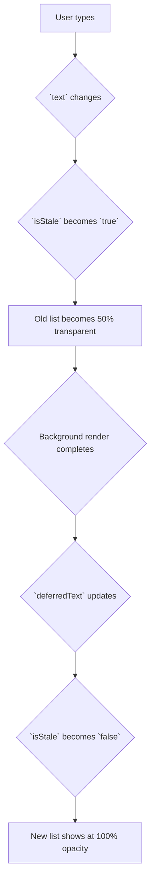

# Stale Content: Pata Data ni User ki Ela Chupinchali? 👀

Okay, `useDeferredValue` anedi slow list ni update cheyyadanni aapi, input field ni fast ga unchuthundi. Super!

Kani, ippudu oka chinna UX (User Experience) problem undi.
*   User search box lo "react hooks" ani type chesadu.
*   Input box lo "react hooks" ani kanipisthundi.
*   Kani, kindha unna list inka "react hook" search results eh chupisthundi (endukante adi inka background lo render avuthune undi).

Ee mismatch user ni confuse cheyyochu. "Nenu type chesindi veru, kindha kanipisthunnadi veru, emayyindi?" ani anukuntadu.

Ee confusion ni solve cheyyadaniki, manam "stale" (pata) content ni chupisthunnappudu, user ki oka visual hint ivvali.

## "Stale" State ni Ela కనుక్కోవాలి?

Idi chala simple. React manaki ee vishayam telusukodaniki oka direct way isthundi. Manam original value ni deferred value tho compare chesthe saripothundi.

```javascript
const [text, setText] = useState('');
const deferredText = useDeferredValue(text);

// THE TRICK!
// `text` (latest value) and `deferredText` (lagging value)
// veru veru ga unte, ante manam stale content chupisthunnam ani ardham.
const isStale = text !== deferredText;
```

Ee `isStale` aney boolean (`true` or `false`) manaki current situation ento chepthundi.

## `isStale` tho UI ni Ela Improve Cheyyali?

Ippudu manam ee `isStale` flag ni use chesi, UI lo chinna changes cheyyochu. A common pattern is to **reduce the opacity** of the stale content.

```jsx
<div style={{ opacity: isStale ? 0.5 : 1 }}>
  <SlowList text={deferredText} />
</div>
```

**How it works:**
1.  Initially, `text` and `deferredText` rendu okate. So, `isStale` is `false`. The list has full opacity (1).
2.  User type cheyyadam start cheyagane, `text` maaruthundi, kani `deferredText` inka pata value lone untundi.
3.  Ippudu `isStale` `true` avuthundi.
4.  The `div` containing our list gets an opacity of `0.5`, so the list becomes slightly transparent or "dimmed".
5.  User ki, "Okay, a list update avuthundi, idi pata data" ani ardham avuthundi.
6.  Background render complete ayyaka, `deferredText` kuda kotha `text` tho equal avuthundi. `isStale` malli `false` avuthundi, and the list returns to full opacity.

Ee chinna visual cue user experience ni chala professional ga and clear ga chesthundi.



And that's it for the theory of `useDeferredValue`! Ippudu neeku adi enduku, ela, and user ki best experience ela ivvalo antha telusu.

Next, manam ee concepts anni kalipi, a "laggy list" example ni full, runnable code tho create cheddam! Ready to build? 💻🚀➡️