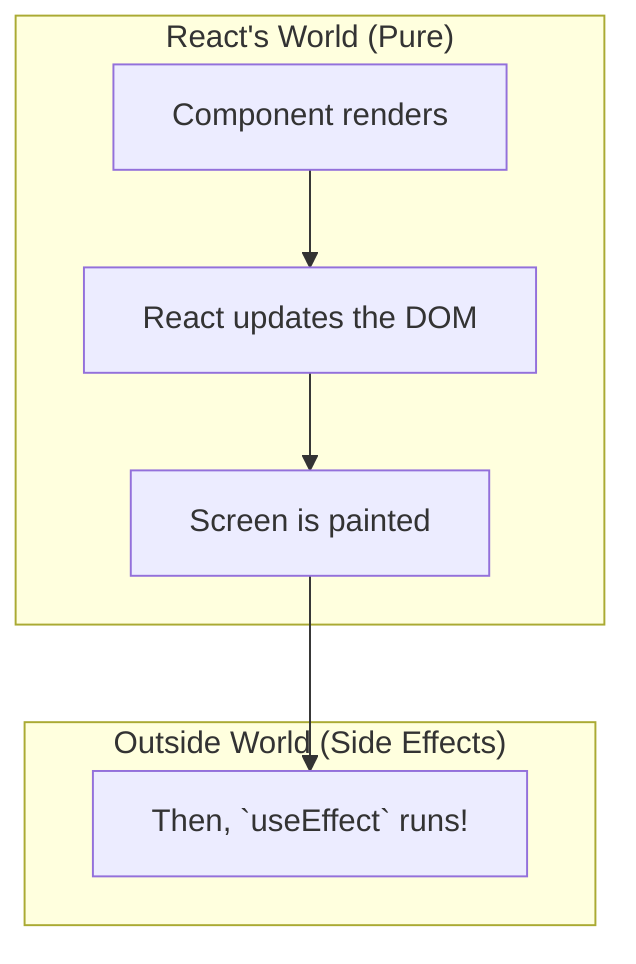

# useEffect: React Prapanchaniki, Bayata Prapanchaniki Varasadhi! 🌉

Hey friend! Welcome to one of the most important chapters in React: `useEffect`. Ee hook chala powerful, kani deenini ardham cheskovadam konchem tricky. Don't worry, manam deenini step-by-step, crystal clear ga nerchukundam.

## `useEffect` Asalu Enduku?

First, oka important vishayam: **`useEffect` anedi React prapanchaniki, bayata prapanchaniki madhyalo oka bridge (varadhi) laantidi.**

React anedi UI ni manage chesthundi. State, props, components... antha React control lo untundi. Kani, mana applications lo manam chala sarlu React control lo leni vishayalatho pani cheyyalsi vasthundi. Veetini manam **"external systems"** antam.

Konni examples of external systems:
*   **Network Requests:** Oka API nunchi data fetch cheyyadam (`fetch`).
*   **Browser APIs:** Timers (`setInterval`), DOM events (`window.addEventListener`), direct DOM manipulation.
*   **Third-party Libraries:** React tho sambandham leni vere JavaScript libraries (e.g., an animation library or a map widget).

Ee external systems tho mana React component ni **synchronize** (anubandham cheyyadam) cheyyadanike manam `useEffect` vadatham.

## "Side Effect" ante enti?

Programming lo, "side effect" ante oka function daani scope bayata unna state ni change cheyyadam.

React components anevi ideally **pure functions** ga undali. Ante, ave props theeskuni, konni JSX ni return cheyyali, anthe. Avi bayata prapanchaniki em effect cheyyakudadu.

Kani manaki API call cheyyali, timers set cheyyali... ive "side effects" anamata. Ee side effects ni mana component rendering logic nunchi separate cheyyadanike, manam వాటిని `useEffect` lopaala pedatham.

`useEffect` chepthundi: "Hey React, nuvvu mundu nee rendering pani antha complete cheseyi. Screen meeda antha update ayyaka, appudu nenu ee side effect code ni run chesthanu."

So, `useEffect` anedi:
*   React ki sambandham leni code ni run cheyyadaniki oka safe place.
*   Idi rendering process ni block cheyyadu.
*   Idi component యొక్క lifecycle (mount, update, unmount) ki hook avvadaniki help chesthundi.

Ippudu neeku `useEffect` యొక్క main purpose ardham ayyindi anukuntunna. Idi kevalam "component render ayyaka code run cheyyadaniki" matrame kadu, adi **external systems tho synchronize** cheyyadaniki.

Next, manam `useEffect` lo atni kante important and confusing part gurinchi matladukundam: **The Dependency Array**. Ee array eh mana Effect eppudu run avvalo decide chesthundi. Ready for the rules? Let's go! 📜➡️