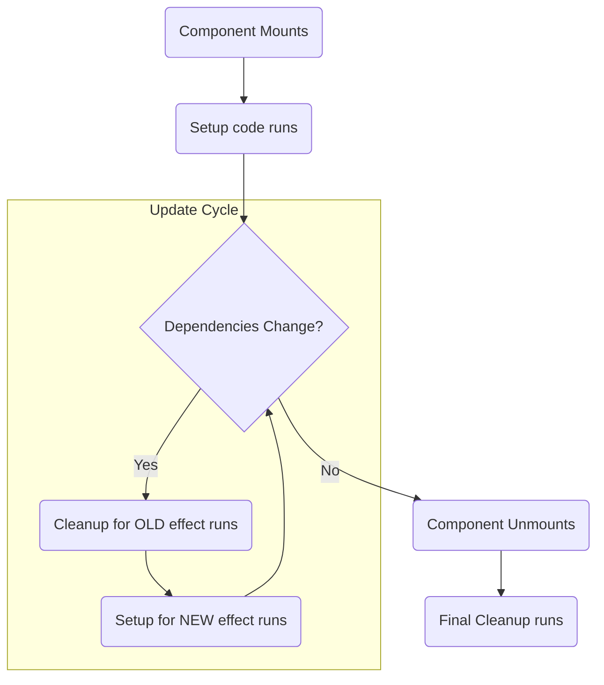

# The Cleanup Function: Memory Leaks ni Aapatam! 🧹

Hey! Manam `useEffect` tho external systems ki connect avvadam nerchukunnam. Super!

Kani, manam oka connection open cheste, or oka subscription start cheste, pani ayipoyaka daanini **close cheyyadam** or **unsubscribe cheyyadam** chala important. Lekapothe, manam **memory leaks** and anavasaramaina bugs ni create chestham.

Ee "cleanup" process kosame, `useEffect` manaki oka special feature isthundi.

## The `return` function from `useEffect`

`useEffect` lopaala manam pass chese `setup` function, optionally inko function ni **return** cheyyochu. Aa return chese function ne **cleanup function** antaru.

```javascript
useEffect(() => {
  // 1. Setup code ikkada untundi...
  console.log('Setting up a subscription...');
  const subscription = someApi.subscribe();

  // 2. Cleanup function ni return cheddam
  return () => {
    // Cleanup code ikkada untundi...
    console.log('Cleaning up the subscription!');
    subscription.unsubscribe();
  };
}, []);
```

**Analogy:** Imagine nuvvu oka room lo light on chesthav (setup). Nuvvu aa room nunchi vellipoye mundu, light off cheyyali (cleanup). Lekapothe current waste avuthundi. Same logic!

## Cleanup Function Eppudu Run Avuthundi?

Idi chala important. The cleanup function runs in two situations:

1.  **Before the next Effect runs:** Nuvvu dependency array `[a]` ichav anuko. `a` value maarinappudu, kotha Effect run avvali. Kani, aa kotha Effect run ayye *mundu*, React pata Effect యొక్క cleanup function ni run chesthundi.
2.  **When the component unmounts:** Component screen nunchi remove ayinappudu (unmounts), React cleanup function ni last time run chesthundi, so antha clean ga untundi.



## Why is Cleanup So Important? An Example.

Manam `window` యొక్క `resize` event ki listen cheddam anukundam.

### The WRONG way (No Cleanup 👎)

```javascript
function WindowWidthTracker() {
  const [width, setWidth] = useState(window.innerWidth);

  useEffect(() => {
    // Event listener ni add chesthunnam
    window.addEventListener('resize', () => setWidth(window.innerWidth));
    // BUT WE NEVER REMOVE IT!
  }, []);

  return <h1>Window width: {width}</h1>;
}
```
**Problem:** Ee component screen meeda kanipinchi, tarvata remove ayyindi anuko (e.g., user vere page ki velladu). Kani manam add chesina event listener inka memory lo untundi! Adi anavasaranga memory ni theeskuntundi. Ilanti components chala unte, app slow aipothundi. Idi memory leak.

### The RIGHT way (With Cleanup 👍)

```javascript
function WindowWidthTracker() {
  const [width, setWidth] = useState(window.innerWidth);

  useEffect(() => {
    const handleResize = () => setWidth(window.innerWidth);

    // Setup: Event listener ni add cheddam
    window.addEventListener('resize', handleResize);
    console.log('Event listener added!');

    // Cleanup: Component unmount ainappudu, listener ni remove cheddam
    return () => {
      window.removeEventListener('resize', handleResize);
      console.log('Event listener removed! Cleaned up.');
    };
  }, []); // Empty array, so this runs only once on mount and cleanup on unmount

  return <h1>Window width: {width}</h1>;
}
```
Ippudu, `WindowWidthTracker` component unmount avvagane, React mana cleanup function ni call chesthundi, and `removeEventListener` tho manam add chesina listener ni clean ga remove chesthundi. No memory leaks! 🎉

Okay, ippudu neeku `useEffect` యొక్క full picture vachindi: setup, dependencies, and cleanup.

Ee concepts ni use chesi, atni kante common use case ni chuddam: **Fetching data from an API**. Deenilo konni tricky parts unnayi. Let's see how to do it correctly in the next section! 🌐➡️