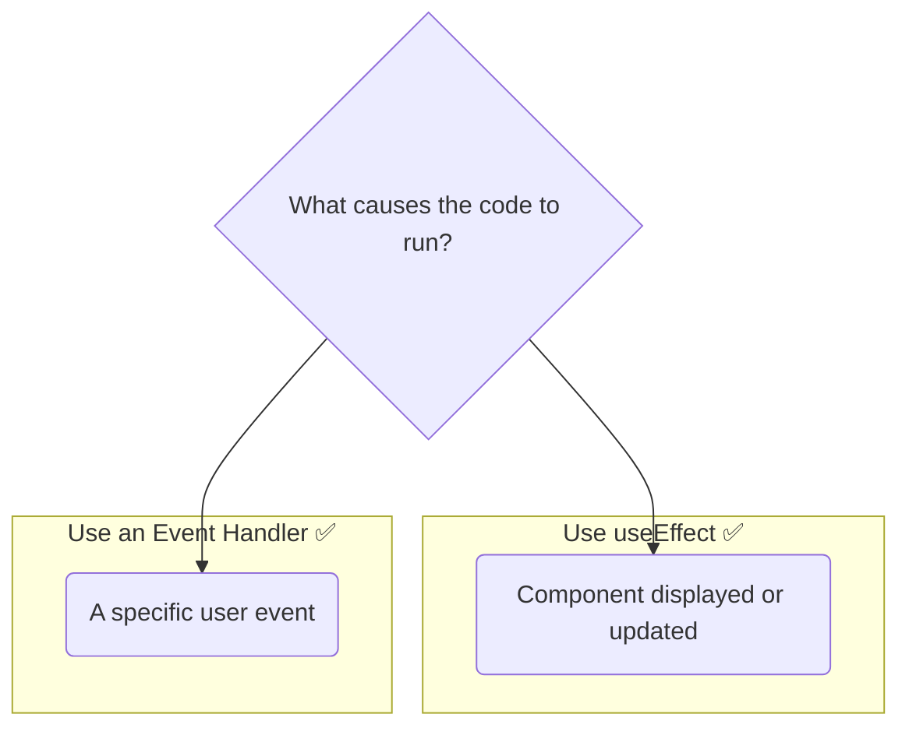

# You Might Not Need an Effect! (Effects ni Ekkada Vadakudadu) 🚫

Hey friend! Manam `useEffect` gurinchi chala nerchukunnam. Adi chala powerful. Kani, React beginners chese oka common mistake entante, **`useEffect` ni anavasaranga, prathi daniki vadadam.**

Sometimes, the best and simplest solution is to *not* use an Effect. Let's see when you can avoid it.

## Anti-Pattern 1: Data Transformation kosam Effect Vadadam

Nuvvu props or state nunchi konni values ni calculate chesi, daanini inko state lo pettadaniki Effect vaduthunnava? For example, oka `firstName` and `lastName` state nunchi `fullName` ni derive cheyyadaniki?

### The WRONG way (with `useEffect` 👎)

```javascript
function Profile({ user }) {
  const [fullName, setFullName] = useState('');

  // ANTI-PATTERN! This is unnecessarily complex.
  useEffect(() => {
    setFullName(`${user.firstName} ${user.lastName}`);
  }, [user]);

  return <h1>{fullName}</h1>;
}
```
**Problem:** Idi chala complex ga undi. Manam oka extra state variable (`fullName`), and oka Effect ni use chesthunnam. `user` prop maarina prathi sari, component re-render avuthundi, *tarvata* Effect run avuthundi, adi state ni set chesthundi, adi *malli* inko re-render ni trigger chesthundi. Anavasaram!

### The RIGHT way (No `useEffect` 👍)

Ee calculation ni manam direct ga rendering logic lo ne cheyyochu.

```javascript
function Profile({ user }) {
  // Calculate directly during render. Simple and efficient!
  const fullName = `${user.firstName} ${user.lastName}`;

  return <h1>{fullName}</h1>;
}
```
Anthe! Chala simple, clean, and efficient. Component render ainappude `fullName` calculate avuthundi. No extra state, no extra re-renders.

**Rule:** If you can calculate something from the existing props or state, **do it during rendering.** Don't use an Effect.

## Anti-Pattern 2: User Events ni Handle Cheyyadaniki Effect Vadadam

Nuvvu oka user event (like a button click) ki response ga state ni update cheyyadaniki `useEffect` vaduthunnava?

### The WRONG way (with `useEffect` 👎)

```javascript
function ShoppingCart({ product, onAddToCart }) {
  const [isAdding, setIsAdding] = useState(false);

  // ANTI-PATTERN! This is not how you handle events.
  useEffect(() => {
    if (isAdding) {
      onAddToCart(product.id);
      setIsAdding(false);
    }
  }, [isAdding, onAddToCart, product.id]);

  return <button onClick={() => setIsAdding(true)}>Add to Cart</button>;
}
```
**Problem:** Idi chala confusing ga, indirect ga undi. User click cheste, manam `isAdding` state ni `true` chesthunnam. Adi oka re-render ni trigger chesthundi. Appudu Effect run ayyi, asalu pani (`onAddToCart`) chesi, malli state ni `false` chesthundi, adi malli inko re-render ni trigger chesthundi. Too complicated!

### The RIGHT way (with an Event Handler 👍)

User events ni handle cheyyadaniki manaki **event handlers** unnayi. Just use them directly!

```javascript
function ShoppingCart({ product, onAddToCart }) {
  // Handle the event directly in the event handler.
  function handleClick() {
    onAddToCart(product.id);
  }

  return <button onClick={handleClick}>Add to Cart</button>;
}
```
This is much simpler, more direct, and easier to understand. User click cheste, `handleClick` function run avuthundi. Anthe. No Effects, no extra state, no extra re-renders.

**Rule:** If some code needs to run because of a specific user interaction, **put that code in an event handler.**



Remembering when *not* to use `useEffect` will make your code cleaner, more predictable, and more performant.

And that's it for the theory of `useEffect`! Ippudu neeku adi enduku, ela, eppudu vadali, and eppudu vadakudadu aney full picture vachindi.

Next, manam ee concepts anni kalipi, konni focused, runnable code examples create cheddam! Ready to build? 💻🚀➡️