# How to Use `useFormStatus`: The Golden Rule 📜

`useFormStatus` ni use cheyadam chala easy, kani deeniki oka chala strict and important rule undi. Ee rule follow avakapothe, adi pani cheyyadu.

### Step 1: Import from `react-dom`

First, and most importantly, ee hook `react` package lo ledu. Idi **`react-dom`** lo untundi. So, import chesetappudu jagrattha.

```javascript
import { useFormStatus } from 'react-dom';
```

### Step 2: The Golden Rule - Must Be Inside a `<form>`!

Idi a hook gurinchi manam gurtupettukovalsina most critical rule.

> The component that calls `useFormStatus` **must** be a child of a `<form>` element.

Ee hook, daaniki deggara ga unna **parent** `<form>` yokka status ni matrame report chesthundi.

**✅ The CORRECT Way:**
```jsx
// A separate component for the button
function SubmitButton() {
  const { pending } = useFormStatus(); // This will work!
  return <button disabled={pending}>Submit</button>;
}

function MyForm() {
  return (
    <form action={...}>
      {/* The component using the hook is INSIDE the form */}
      <SubmitButton />
    </form>
  );
}
```

**❌ The WRONG Way:**
```jsx
function MyForm() {
  // 🚩 WRONG: Calling the hook in the same component that renders the form
  const { pending } = useFormStatus(); // This will NOT work. `pending` will always be false.

  return (
    <form action={...}>
      <button disabled={pending}>Submit</button>
    </form>
  );
}
```
Endukante, `useFormStatus` kevalam paina unna parent form kosam vethukutundi, adi render ayina component loni form kosam kadu.

### Step 3: Use the Returned Status Object

`useFormStatus()` ni call cheste, adi manaki oka status object ni isthundi.
```javascript
const { pending, data, method, action } = useFormStatus();
```
Ee object lo properties:
*   **`pending`**: A boolean. Form submit avuthunnappudu `true`, migitha time lo `false`. Idi manam ekkuvaga vadathamu.
*   **`data`**: A `FormData` object. Form submit chese time lo, aa form loni data (`name`, `email`, etc.) ikkada untundi. Submission `pending` lo unnappudu matrame deenilo value untundi.
*   **`method`**: A string (`'get'` or `'post'`). Form ye HTTP method tho submit avuthundo chepthundi.
*   **`action`**: Form `action` prop ki manam pass chesina function reference.

```mermaid
graph TD
    A["<form>"] -- renders --> B["<MyComponent>"];
    subgraph MyComponent
        C(calls `useFormStatus`) --> D{Finds parent form};
        D -- Yes --> E[Receives status object ✅];
        D -- No --> F[Status is null/default ❌];
    end
    B --> C;

    style A fill:#e6f7ff
    style E fill:#d4edda
    style F fill:#ffcccc
```



**Key Takeaway:** The structure is always the same: create a separate component for your form controls (like a submit button), render that component *inside* the `<form>`, and call `useFormStatus` from within that child component.

Ippudu ee knowledge tho, manam oka full, practical example ni build cheddam: form submit avuthunnappudu automatic ga disable ayye oka "smart" submit button! Let's see it in action! 🎬➡️