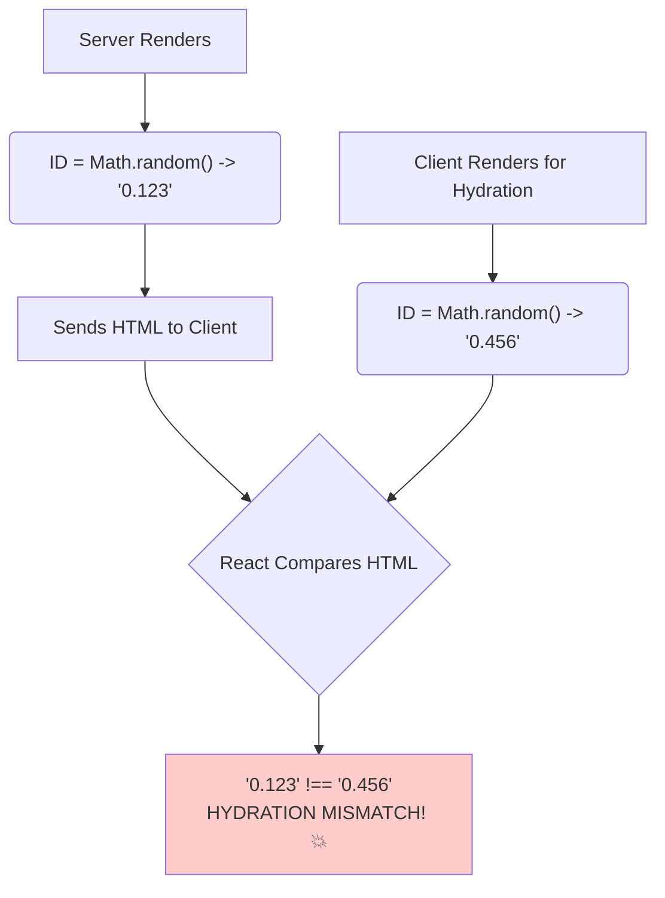

# The Problem: Unstable IDs & Hydration Mismatch  mismatched IDs

Hey friend! Welcome to the `useId` chapter. Ee hook chala simple ga untundi, kani idi chala important problem ni solve chesthundi, especially **accessibility (a11y)** and **Server-Side Rendering (SSR)** vishayam lo.

## Asalu ID's Enduku Kavali?

HTML lo, manam `<label>` ni `<input>` ki connect cheyyadaniki `id` and `htmlFor` attributes vadatham. Idi chala important. Label meeda click cheste, corresponding input field focus avuthundi. Idi screen reader use chese users ki chala help chesthundi.

```html
<label for="my-email">Email:</label>
<input id="my-email" type="email" />
```

## The React Problem: Reusable Components

React lo manam components ni reusable ga build chestham. Ante, oke `EmailField` component ni manam page lo chala sarlu vadacchu.

Ippudu, manam `id="my-email"` ani hardcode cheste emavuthundi? Page lo anni email fields ki oke ID untundi. **HTML lo IDs anevi unique ga undali.** Oke ID chala sarlu unte, adi invalid HTML and accessibility issues ki dari theesthundi.

## "Okay, I'll just use `Math.random()`" - A BAD Idea! 👎

"Unique ID kavali ante, `Math.random()` vadesta saripothundi ga?" anukuntunnava? This is a very common mistake, and it leads to a big problem with Server-Side Rendering.

**Server-Side Rendering (SSR):** Modern React apps lo, performance kosam, manam modati HTML ni server lo generate chesi, client ki pampistham. Tarvata client lo React ("hydration") aa HTML ki event listeners ni attach chesthundi.

**The Problem:**
1.  Server `EmailField` component ni render chesthundi. `Math.random()` run ayyi, oka ID generate chesthundi (e.g., `id="0.123"`). Ee HTML client ki velthundi.
2.  Client lo, React malli `EmailField` component ni render chesthundi (hydration kosam). `Math.random()` malli run avuthundi, kani ee sari **oka kotha ID** generate chesthundi (e.g., `id="0.456"`).
3.  React server nunchi vachina HTML (`id="0.123"`) ni, client lo generate aina HTML (`id="0.456"`) tho compare chesthundi.
4.  **"Hydration Mismatch!"** 🚨 React chusthundi, "Server lo unna ID veru, client lo unna ID veru. Edho theda ga undi!" ani oka pedda warning isthundi. App behave cheyyadam lo thedalu ravochu.



So, `Math.random()` is out. A simple counter (`let id = 0; id++`) kuda complex apps lo ilanti problems a create chesthundi.

Ee unique, stable, and SSR-friendly ID generation problem ni solve cheyyadanike, React manaki `useId` aney hook ni ichindi.

Next, manam `useId` ee problem ni ela elegant ga solve chesthundo chuddam. Ready? Let's go! ✨➡️