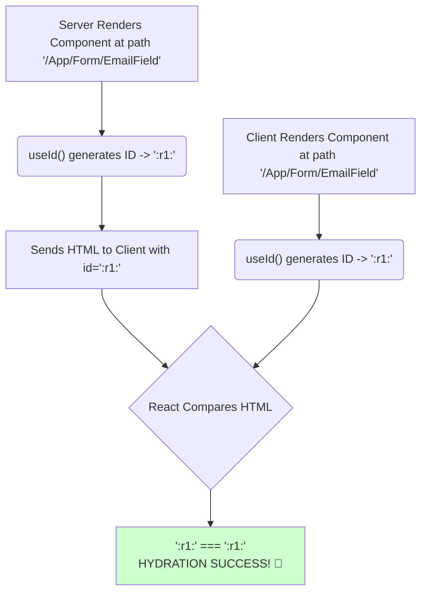

# The Solution: `useId` tho Stable IDs ni Generate Cheyyadam! 🛡️

Manam `Math.random()` lanti methods valla vache hydration mismatch problem gurinchi chusam. Ee problem ni solve cheyyadanike React manaki `useId` aney hook ni ichindi.

## Asalu `useId` ante enti?

`useId` anedi oka simple React Hook. Daani pani okkate: **oka unique ID string ni generate cheyyadam.**

Kani, deeni superpower entante, ee ID:
1.  **Unique:** Page lo enni sarlu oke component render aina, prathi daaniki veru veru ID generate avuthundi.
2.  **Stable & Predictable:** Atni kante ముఖ్యంగా, server lo render ainappudu generate aina ID, client lo hydration appudu generate aina ID **exactly a समानంగా** untundi.

Ee stability valla, manaki inka hydration mismatch errors raavu.

## `useId` Ela Pani Chesthundi? (The Magic)

`useId` anedi `Math.random()` lanti random number ni generate cheyyadu. Instead, adi aa component యొక్క "parent path" (ante, component tree lo daani location) meeda aadharapadi oka ID ni generate chesthundi.

Server and client lo component tree oke laaga unte, aa "parent path" kuda oke laaga untundi. So, `useId` generate chese ID kuda server and client lo oke laaga untundi. Problem solved!

## Why `useId` is the Best Choice

*   **Accessibility:** `<label>` ni `<input>` ki correct ga connect cheyyadaniki help chesthundi.
*   **SSR-Friendly:** Server rendering and hydration tho perfectly pani chesthundi. No more mismatch errors.
*   **Unique:** Multiple instances of a component unna, IDs clash avvavu.
*   **Simple:** Chala easy to use. Just call the hook, anthe.

**Important Note:** `useId` ni list lo items ki `key` prop ga vadakudadu. `key` prop eppudu nee data nunchi vachina stable ID (like `item.id`) ayyi undali. `useId` anedi kevalam accessibility attributes (`htmlFor`, `id`, `aria-describedby` etc.) kosam matrame.

Ippudu neeku `useId` enduku intha importanto ardham ayyindi anukuntunna.

Next, manam deeni syntax ento, and oka simple form lo deenini ela use cheyyalo chuddam. It's very straightforward! Let's go! ➡️