# The Solution: `useImperativeHandle` tho Custom API ni Create Cheyyadam! 🎮

Manam `forwardRef` tho vache encapsulation problem gurinchi chusam. Parent component ki child యొక్క DOM node meeda full control vellipothundi.

Ee problem ki solution eh `useImperativeHandle`.

## Asalu `useImperativeHandle` ante enti?

`useImperativeHandle` anedi oka React Hook. Idi manaki **parent component ki expose ayye `ref` handle ni customize** cheyyadaniki help chesthundi.

Ante, parent component `ref.current` ani call chesinappudu, daaniki lopaala unna DOM node ni ivvakunda, manam define chesina oka custom object ni ivvochu. Ee object lo manam parent ki ivvali anukuntunna methods matrame untayi.

**Back to our car analogy:**
*   `forwardRef` alone is like giving the whole toolbox. 🧰
*   `useImperativeHandle` is like designing a custom remote control (a "handle") with only three buttons: `start()`, `stop()`, and `honk()`. 🎮

Parent component ippudu ee remote control tho car ni control cheyyochu, kani engine ni open chesi mess cheyyaledu. This is much safer!

## How Does it Solve Our Problem?

`useImperativeHandle` tho, manam `CustomInput` component ni ila marchochu:

1.  Parent nunchi vachina `ref` ni direct ga `<input>` ki ivvakunda, `useImperativeHandle` ki istham.
2.  `useImperativeHandle` lopaala, manam oka object ni create chesi, daanilo manam expose cheyyali anukuntunna methods (`focus`, `clear` etc.) ni define chestham.
3.  Ippudu parent component యొక్క `ref.current` aa `<input>` DOM node ni point cheyyadu. Adi manam create chesina custom object (`{ focus: ..., clear: ... }`) ni point chesthundi.

Parent ippudu `ref.current.focus()` ani call cheyyagaladu, kani `ref.current.style.backgroundColor = 'red'` lantiవి cheyyaledu, endukante manam aa `style` property ni expose cheyyaledu.

```mermaid
graph TD
    subgraph "Without useImperativeHandle"
        A(Parent's ref) --> B(Child's <input> DOM Node);
        B --> B1(".value");
        B --> B2(".style");
        B --> B3(".focus()");
        B --> B4("...and everything else!");
    end

    subgraph "With useImperativeHandle ✅"
        C(Parent's ref) --> D{Custom Handle Object};
        D --> D1("{ focus: fn, clear: fn }");
        D1 --> D2("Only `focus` and `clear` are exposed!");
    end

    style B fill:#ffcccc
    style D fill:#ccffcc
```

Ee approach valla, mana `CustomInput` component యొక్క encapsulation maintain avuthundi. Adi bayata prapanchaniki kevalam konni specific actions ni matrame expose chesthundi, creating a clean and safe public API.

Ippudu neeku `useImperativeHandle` యొక్క main purpose ardham ayyindi anukuntunna. Idi `forwardRef` ki oka "safety layer" laantidi.

Next, manam deeni syntax ento and `forwardRef` tho kalipi deenini step-by-step ela use cheyyalo chuddam. Ready for the code? Let's go! 👨‍💻➡️