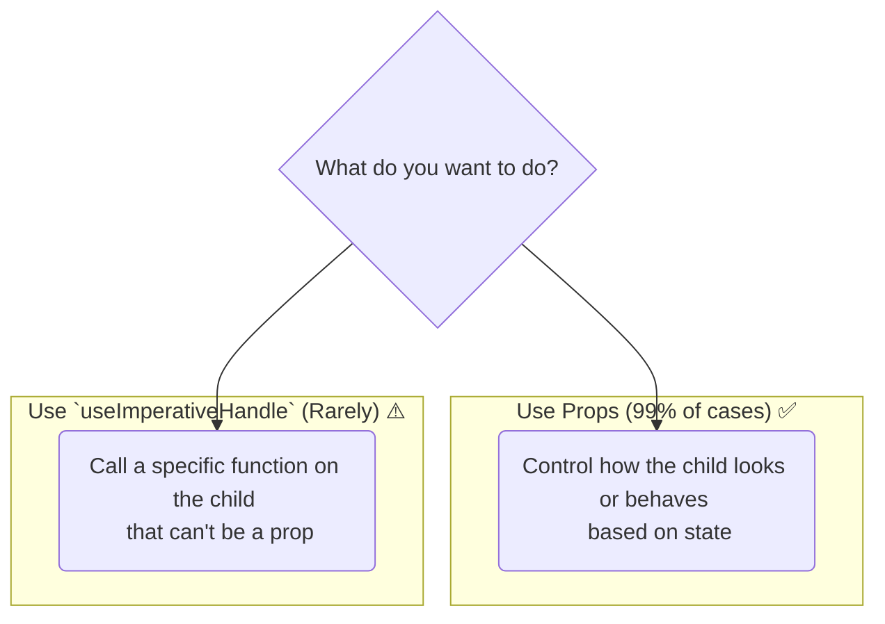

# Ee Hook ni Eppudu Vadali? (Hint: Chala Takkuva Sarlu!) ⚠️

Manam `useImperativeHandle` entha powerful o chusam. Kani, oka vishayam chala clear ga gurthu pettukovali: **`useImperativeHandle` anedi oka "escape hatch".**

"Escape hatch" ante, React యొక్క main declarative model nunchi bayataki velli, konchem "imperative" (direct command-style) code rayadaniki oka door anamata.

**Declarative (The React Way 👍):** Manam UI *ela undalo* cheptham, React adi ela cheyyalo chuskuntundi.
`{isOpen ? <Modal /> : null}` (Ikkada manam "Modal kanipinchali" ani declare chesthunnam).

**Imperative (The "Old" Way 👎):** Manam UI ki direct ga commands istham.
`modal.open()`, `modal.close()` (Ikkada manam "Modal, ippudu open avvu" ani command chesthunnam).

React declarative model valla chala predictable ga and easy ga untundi. Manam imperative code rasinappudu alla, aa predictability ni konchem kolpothunnam.

## So, Asalu Eppudu Vadali?

99% of the time, nuvvu props tho ne pani cheyyochu.

**Example:** Oka `Modal` component undi anuko. Daaniki `open()` and `close()` methods ni expose cheyyadaniki `useImperativeHandle` vadadam **WRONG**.

### ❌ The WRONG Way (Imperative)
```jsx
// Parent
const modalRef = useRef(null);
<button onClick={() => modalRef.current.open()}>Open</button>
<Modal ref={modalRef} />

// Child (Modal.jsx)
// Exposes `open` and `close` methods via useImperativeHandle
```

### ✅ The RIGHT Way (Declarative)
```jsx
// Parent
const [isOpen, setIsOpen] = useState(false);
<button onClick={() => setIsOpen(true)}>Open</button>
<Modal isOpen={isOpen} onClose={() => setIsOpen(false)} />

// Child (Modal.jsx)
// Just uses the `isOpen` prop to show/hide itself.
// No refs, no imperative handles needed.
```
The declarative way is much cleaner, more predictable, and easier to debug.

## So... When is it ACTUALLY okay to use `useImperativeHandle`?

Kevalam props tho handle cheyyaleni konni rare situations lo matrame `useImperativeHandle` vadali. Eevi almost eppudu browser DOM tho direct ga interact avvadam gurinchi untayi.

**Good Use Cases:**
*   **Managing Focus:** Parent nunchi child input ni focus cheyyadam. `input.focus()` anedi oka imperative browser API.
*   **Scrolling to an Element:** Parent oka button click cheste, child component lopaala unna oka specific element ki scroll cheyyadam.
*   **Triggering Animations:** Oka imperative animation library tho pani chesetappudu, `animation.play()` or `animation.pause()` lanti methods ni trigger cheyyadaniki.

**Rule of Thumb:**
Nee manasulo "Nenu ee child component ni *select chesi*, daani meeda oka *action cheyyali*" ane thought vasthe, appudu `useImperativeHandle` avasaram padocchu.
Kani, "Nenu ee child component ki *konni data ichi*, adi *ela kanipinchalo cheppali*" ane thought unte, appudu props eh correct solution.



Remember, always try to find a declarative solution first. Use `useImperativeHandle` only when you have no other choice.

And that's it for `useImperativeHandle`! I hope this gives you a clear idea of this powerful but rarely needed hook.

Next, let's build the code examples to see this in action! 💻✨➡️