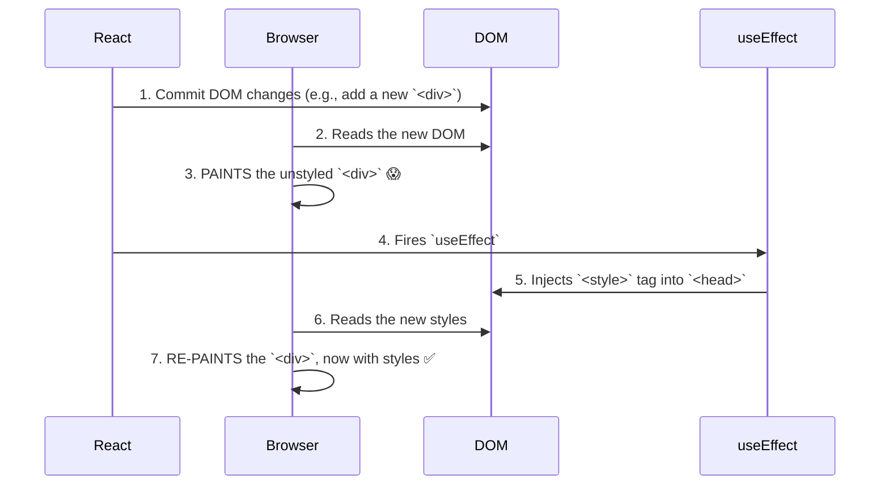

# The Problem: The "Flicker" of Unstyled Content 🎨

Manam `useInsertionEffect` anedi CSS-in-JS libraries kosam ani cheppukunnam. Kani, asalu aa libraries ki em problem vachindi? Why did they need a new hook?

The problem is a small but annoying visual glitch called a **FOUC (Flash of Unstyled Content)**, or simply, a "flicker".

## The Race Condition

Imagine chesko, oka CSS-in-JS library `useEffect` ni use chesi styles ni inject chesthundi anukundam.

Here's the sequence of events during a render:
1.  **Render:** React component render avuthundi. Kotha DOM structure ela undalo calculate cheskuntundi.
2.  **Commit (DOM Update):** React ee changes ni theeskuni, asalu DOM ni update chesthundi. For example, kotha `
` ni add chesthundi.
3.  **Browser Paint:** Browser chusthundi, "Oh, kotha `
` vachindi!" and daanini screen meeda render chesthundi. **Kani, ee point lo, daaniki కావలసిన kotha CSS styles inka inject avvaledu!** So, aa `
` unstyled ga kanipisthundi.
4.  **`useEffect` Runs:** Finally, `useEffect` run avuthundi. Lopaala unna CSS-in-JS library code run ayyi, kotha `<style>` tag ni `<head>` lo inject chesthundi.
5.  **Browser Re-Paint:** Browser chusthundi, "Oh, kotha styles vachayi!" and aa `
` ki kotha styles ni apply chesi, malli render chesthundi.

Ee process antha chala fast ga jaruguthundi, kani oka fraction of a second, user ki **unstyled content kanipinchi, ventane styled content ga maaruthundi.** Ee "flicker" chala unprofessional ga kanipisthundi.

## What about `useLayoutEffect`?

"Okay, `useEffect` late ga run avuthundi. `useLayoutEffect` vadithe saripothundi ga? Adi DOM updates tarvata, browser paint ki mundu run avuthundi kadha?" anukuntunnava?

You're right, `useLayoutEffect` is better, but it's not perfect. Pedda applications lo, or concurrent rendering features use chesthunappudu, `useLayoutEffect` lopaala styles ni inject cheyyadam kuda performance ni block cheyyochu. React team ki inka better, inka predictable solution kavali anipinchindi.

The ideal solution would be to inject the styles **even before `useLayoutEffect`**, as early as possible, right after React calculates the DOM changes but *before* it commits them.

Ee "perfect timing" kosame `useInsertionEffect` create chesaru.

Next, manam `useInsertionEffect` ee "perfect timing" tho flicker problem ni ela completely solve chesthundo chuddam. Ready for the final piece of the puzzle? Let's go! 🧩➡️