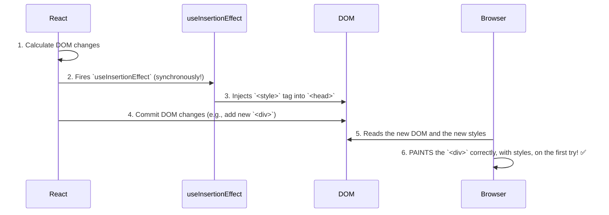

# The Solution: Injecting Styles BEFORE the DOM Changes! ⚡️

Manam CSS-in-JS libraries tho vache "flicker" problem gurinchi chusam. Ee problem ki solution `useInsertionEffect` యొక్క special timing lo undi.

## `useInsertionEffect` యొక్క Superpower: Perfect Timing

`useInsertionEffect` anedi `useEffect` or `useLayoutEffect` kanna **mundu** run avuthundi. Idi React render lifecycle lo oka chala specific and early stage lo fire avuthundi.

Here's the new, improved sequence of events with `useInsertionEffect`:

1.  **Render:** React component render avuthundi. Kotha DOM structure ela undalo calculate cheskuntundi.
2.  **`useInsertionEffect` Runs:** React DOM ni update cheyyaka *mundhe*, `useInsertionEffect` synchronously run avuthundi.
3.  **Style Injection:** Lopaala unna CSS-in-JS library code run ayyi, kotha `<style>` tag ni `<head>` lo **inject chesthundi**.
4.  **Commit (DOM Update):** Ippudu React asalu DOM ni update chesthundi (e.g., kotha `
` ni add chesthundi).
5.  **Browser Paint:** Browser chusthundi, "Oh, kotha `
` vachindi!" and daani kosam styles ni vethukuthundi. Ee time ki, కావలసిన styles antha already `<head>` lo unnayi! So, browser ventane aa `
` ni **correct styles tho** render chesthundi.

Result? **No flicker!** 🎉 User eppudu unstyled content ni chudadu.

Ee hook valla, style injection anedi rendering process tho paatu "in sync" ga jaruguthundi, ensuring a smooth user experience.

## Why not just use `useLayoutEffect`?

`useLayoutEffect` kuda synchronous eh, kani adi DOM mutations *tarvata* run avuthundi. `useInsertionEffect` DOM mutations ki *mundu* run avuthundi. Ee chinna difference eh flicker ni aapataniki key. Style injection ki, the earlier, the better.

Ippudu neeku ee hook asalu enduku create chesaro, adi em problem solve chesthundo full clarity vachindi anukuntunna.

Ee topic ni complete cheyyadaniki, manam ee moodu "Effect" hooks (`useEffect`, `useLayoutEffect`, and `useInsertionEffect`) యొక్క timing ni side-by-side compare cheddam. Appudu neeku vaati madhyalo unna theda inka clear ga ardham avuthundi. Let's see the full picture next! 🖼️➡️