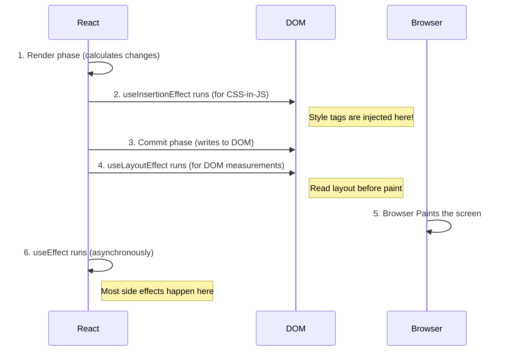

# The Timing: `useEffect` vs `useLayoutEffect` vs `useInsertionEffect` ⏰

Manam ippati varaku moodu "Effect" hooks gurinchi nerchukunnam. Vaati madhyalo unna asalu theda vaati **timing** lo ne undi. Ee timing ni ardham cheskunte, e hook ni eppudu vadalo neeku crystal clear aipothundi.

Let's see the sequence of events in a React render cycle.

---

### 1. `useInsertionEffect`

*   **When it runs:** Synchronously, **after** React has calculated the DOM changes, but **before** it actually writes those changes to the screen.
*   **What it can access:** DOM ni read cheyyaledu (endukante adi inka update avvaledu). Refs inka attach ayyi undavu.
*   **Purpose:** CSS-in-JS libraries kosam, `<style>` tags ni DOM loki inject cheyyadaniki. Ee styles next step (DOM mutation) ki ready ga untayi.
*   **Analogy:** Chef vanta cheyyadaniki mundu, kitchen antha ready cheskovadam laantidi. 🔪

---

### 2. `useLayoutEffect`

*   **When it runs:** Synchronously, **after** React has written the changes to the DOM, but **before** the browser has painted those changes to the screen.
*   **What it can access:** DOM ni safe ga read cheyyochu. Nuvvu DOM element యొక్క size, position lantiవి ikkada measure cheyyochu.
*   **Purpose:** DOM measurements theeskuni, synchronously component ni re-render cheyyadaniki. For example, oka tooltip యొక్క position ni calculate cheyyadaniki.
*   **Analogy:** Chef vantakam ni plate lo pettesadu, kani daanini garnish chesi, final presentation cheyyadaniki mundu. 🍽️

**Warning:** Idi synchronous kabatti, deeni lopaala heavy logic unte, adi browser paint ni block chesi, app ni slow chesthundi. Vadakamundara jagratha!

---

### 3. `useEffect`

*   **When it runs:** Asynchronously, **after** React has updated the DOM *and* the browser has painted the changes to the screen.
*   **What it can access:** DOM ni safe ga read cheyyochu.
*   **Purpose:** React ki sambandham leni external systems tho synchronize avvadaniki. (Data fetching, timers, event listeners, etc.). Idi atni kante common ga use chese Effect.
*   **Analogy:** Vantakam antha ready ayyi, customer ki serve chesesaru. Tarvata, nuvvu kitchen clean cheyyadam or next order ki prepare avvadam laantidi. 🧼

---

## The Full Timeline (Visualized)

And that's it! Ee aaru steps lo, last 3 steps eh mana three Effect hooks యొక్క timing. Ippudu neeku vaati madhyalo unna theda clear ga ardham ayyindi anukuntunna.

Remember:
*   95% of the time, you will use **`useEffect`**.
*   Rare cases lo, DOM layout ni measure cheyyadaniki **`useLayoutEffect`** vadathav.
*   Nuvvu CSS-in-JS library rasthe thappa, **`useInsertionEffect`** ni nuvvu eppudu vadavu.

I hope this was super clear. Let's build a small conceptual example to see this in code. 💻➡️