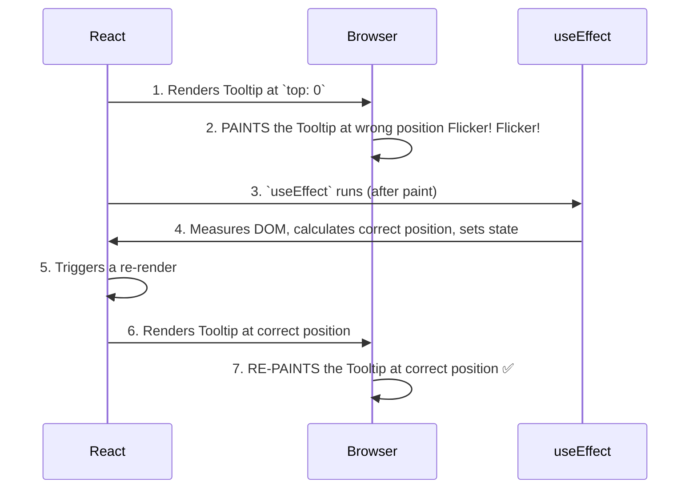

# The Problem: The "Visual Flicker" Effect 👁️

Manam `useLayoutEffect` anedi DOM layout ni measure cheyyadaniki ani cheppukunnam. Kani, ade pani `useEffect` tho cheste emavuthundi? Why can't we just use the default `useEffect`?

Let's understand the problem with a classic example: **a tooltip**.

## The Tooltip Scenario

Imagine chesko, manam oka button meeda hover cheste, daani paina oka tooltip kanipinchali.

Kani, aa tooltip lopaala unna text length ni batti, daani width and height maaruthayi. Manam daanini correct ga position cheyyali ante, mundu daani size ento teliyali.

So, the process to correctly position the tooltip has two steps:
1.  First, render the tooltip on the screen (somewhere, anywhere) to find out its actual size (`width` and `height`).
2.  Then, use that size to calculate the correct position (e.g., `top` and `left` coordinates) and render it again.

## The Problem with `useEffect`'s Timing

Ippudu, ee logic ni manam `useEffect` lo pedithe emavuthundo chuddam.

1.  **First Render:** React `Tooltip` component ni render chesthundi. Ee stage lo manaki daani height teliyadu, so manam daanini default position lo pedatham (e.g., `top: 0`).
2.  **Commit:** React ee `Tooltip` ni DOM lo peduthundi.
3.  **Browser Paints 🎨 (Problematic Step):** Browser chusthundi, "Oh, kotha tooltip vachindi!" and daanini **default position (`top: 0`) lo screen meeda chupinchestundi.** User ippudu tooltip ni wrong place lo chustadu.
4.  **`useEffect` Runs:** Ippudu, finally, `useEffect` run avuthundi.
5.  **Measure & Re-render:** Effect lopaala, manam tooltip యొక్క height ni measure chesi, correct `top` position ni calculate chesi, state ni update chestham (`setTooltipPosition(...)`). Ee state update inko re-render ni trigger chesthundi.
6.  **Second Render:** `Tooltip` component ippudu correct position tho re-render avuthundi.
7.  **Second Paint:** Browser ee kotha change ni theeskuni, tooltip ni correct position ki move chesi, malli screen ni paint chesthundi.

Ee process antha chala fast ga jarigina, user కంటికి, aa tooltip **oka chota kanipinchi, ventane inko chotaki jump** ayinattu kanipisthundi. Ee "jump" or **"flicker"** anedi chala jarring ga and unprofessional ga untundi.

Ee flicker problem valla, user experience debba thintundi. Manam ee "double paint" ni avoid cheyyali. The user should only see the final, correctly positioned tooltip.

Ee flicker ni solve cheyyadanike, manam `useLayoutEffect` ni vadatham. Adi `useEffect` kanna mundu run avvadam valla, ee problem solve avuthundi.

Next, manam `useLayoutEffect` ee flicker ni ela completely eliminate chesthundo chuddam. Ready for the smooth solution? ✨➡️