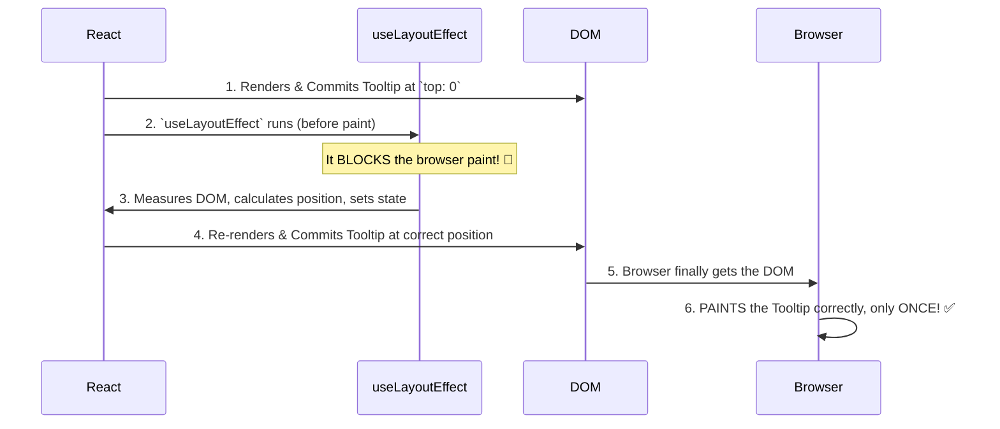

# The Solution: Measuring Layout BEFORE the Browser Paints! 🖼️

Manam `useEffect` tho vache "flicker" problem gurinchi chusam. Ee problem ki solution `useLayoutEffect` యొక్క special timing lo ne undi.

## `useLayoutEffect` యొక్క Superpower: Blocking the Browser Paint

`useLayoutEffect` anedi `useEffect` laaga asynchronous kadu. Adi **synchronous**.

Adi chepthundi, "Hey browser, nenu lopaala unna pani antha complete chese varaku, nuvvu screen ni paint cheyyakunda wait cheyyi."

Ee "blocking" behaviour ee flicker ni solve chesthundi.

## The New, Flicker-Free Sequence

Ippudu manam mana tooltip logic ni `useLayoutEffect` lo pedithe emavuthundo chuddam.

1.  **First Render:** React `Tooltip` component ni render chesthundi (default position `top: 0` tho).
2.  **Commit:** React ee `Tooltip` ni DOM lo peduthundi.
3.  **`useLayoutEffect` Runs:** Browser paint cheyyaka *mundhe*, `useLayoutEffect` synchronously run avuthundi.
4.  **Measure & Re-render:** Effect lopaala, manam tooltip యొక్క height ni measure chesi, correct `top` position ni calculate chesi, ventane state ni update chestham (`setTooltipPosition(...)`).
5.  **Second Render:** `useLayoutEffect` synchronous kabatti, React ee state update ni kuda ventane process chesi, `Tooltip` component ni **malli re-render chesthundi**, ippudu correct position tho.
6.  **Browser Paints 🎨 (The Final Result):** Ee process antha ayyaka, browser screen ni paint cheyyadam start chesthundi. Ee time ki, daani daggara lopaala jarigina rendu renders యొక్క final result (correct position lo unna tooltip) matrame untundi.

User kevalam **final, correctly positioned tooltip ni matrame** chustadu. No jump, no flicker! 🎉

Chusava? `useLayoutEffect` antha pani "behind the scenes" ga, browser paint cheyyaka mundhe cheyyadam valla, user experience chala smooth ga untundi.

Ee power valla, `useLayoutEffect` chala useful ga unna, daaniki oka dark side undi. Adi browser paint ni block chesthundi kabatti, deeni lopaala slow logic unte, adi mee app ni antha slow cheyyagaladu.

So, deenini eppudu vadali, and eppudu `useEffect` eh better? Let's discuss this very important topic next. 🤔➡️