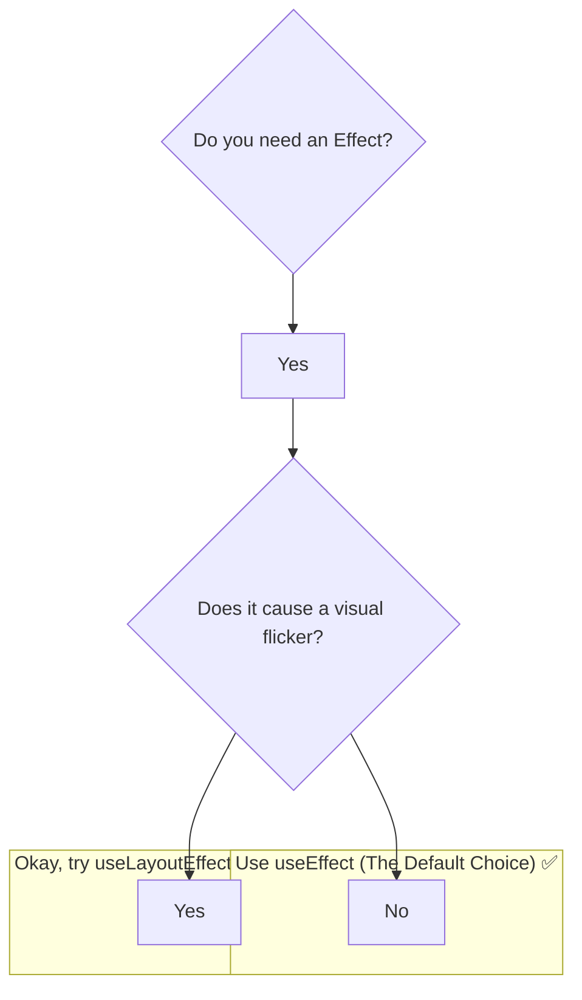

# When to Use `useLayoutEffect`? (99% of the time, you don't!) ⚠️

Manam `useLayoutEffect` flicker problem ni ela solve chesthundo chusam. Ippudu atni kante important question: "Nenu eppudu `useEffect` vadali, eppudu `useLayoutEffect` vadali?"

The answer is simple:

**Always start with `useEffect`.**

`useLayoutEffect` anedi oka special tool, anthe kani `useEffect` ki replacement kadu.

## The Performance Cost of `useLayoutEffect`

`useLayoutEffect` synchronous ga run avvadam valla, adi browser paint ni **block** chesthundi.

Ante, `useLayoutEffect` lopaala unna code antha complete ayye varaku, user screen meeda em chudadu. Oka chinna loading spinner kuda kanipinchadu.

*   Nee `useLayoutEffect` lopaala logic fast ga unte, parvaledu.
*   Kani, daani lopaala konchem slow logic (like a complex calculation or a state update that causes a big re-render) unte, nee app antha "stuck" or "frozen" aipoyinatlu kanipisthundi.

`useEffect`, on the other hand, is asynchronous. Adi paint ni block cheyyadu. So, UI eppudu responsive ga untundi. Anduke, **performance kosam, `useEffect` is almost always the better choice.**

## So, When is `useLayoutEffect` the ONLY Choice?

Oka simple rule of thumb undi. Nuvvu `useEffect` vadinappudu, nee UI lo edaina **visual flicker** or "jump" kanipisthe, appudu daanini `useLayoutEffect` ga marchadaniki try cheyyi.

The only valid use case for `useLayoutEffect` is:
1.  You need to **measure something about the DOM** (like an element's size or position).
2.  You need to use that measurement to **synchronously re-render the component** before the browser gets a chance to paint.

Ee specific condition meet aithe thappa, `useLayoutEffect` vadakudadu.

**In summary:**
*   Start with `useEffect`.
*   If you see a flicker, and only if you see a flicker, ask yourself if you're measuring layout.
*   If yes, try switching to `useLayoutEffect` and see if it fixes the problem.

And that's it! `useLayoutEffect` is a sharp tool for a specific job. Ippudu neeku daanini eppudu, ekkada, and entha jagratha ga vadalo ardham ayyindi anukuntunna.

Next, manam ee flicker problem ni and daani solution ni side-by-side, oka full, runnable code example lo chuddam! Ready to build? 💻✨➡️