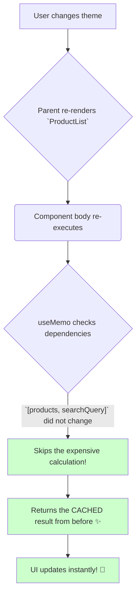

# The Solution: `useMemo` tho Calculation Results ni Cache Cheyyadam! 🧠

Manam prathi render lo expensive calculations run avvadam valla vache performance problem gurinchi chusam. Ee problem ki solution eh `useMemo`.

## Asalu `useMemo` ante enti?

`useMemo` anedi oka React Hook. Idi oka expensive calculation యొక్క **result** ni re-renders madhyalo **cache** cheyyadaniki (or "memoize" cheyyadaniki) help chesthundi.

Ante, `useMemo` tho wrap chesina calculation, daani dependencies maarithe thappa, prathi re-render ki malli run avvadu. React manaki pata result ne malli isthundi.

Simple ga cheppalante: **`useMemo` remembers the result of a calculation.** 💡

## How Does it Solve Our Problem?

Mana slow filtering example ki vacheddam. Manam `filterProducts` aney expensive calculation ni `useMemo` tho wrap cheddam.

```jsx
import { useMemo } from 'react';

function ProductList({ products, searchQuery, theme }) {

  // useMemo tho `filteredProducts` ni cache chesthunnam
  const filteredProducts = useMemo(() => {
    console.log('Filtering products... (Slow operation!)');
    return filterProducts(products, searchQuery);
  }, [products, searchQuery]); // Dependencies: `products` and `searchQuery`

  return (
    <div className={theme}>
      <input value={searchQuery} ... />
      <ul>
        {filteredProducts.map(p => <li key={p.id}>{p.name}</li>)}
      </ul>
    </div>
  );
}
```

**Ippudu em jarugutundi?**
1.  **First Render:** Component render ainappudu, `useMemo` lopaala unna function (`() => filterProducts(...)`) run avuthundi. Result (the filtered list) cache cheyyabaduthundi and `filteredProducts` variable ki assign avuthundi.
2.  **User changes `searchQuery`:** `searchQuery` anedi dependency kabatti, `useMemo` lopaala unna function malli run avuthundi. Kotha result cache cheyyabaduthundi and return avuthundi. Correct!
3.  **User changes `theme`:** Ippudu component re-render avuthundi. `useMemo` chusthundi:
    *   `products` maaraledu.
    *   `searchQuery` maaraledu.
    *   "Aha! Dependencies em maaraledu," anukuni, `useMemo` lopaala unna slow function ni **run cheyyakunda skip chesthundi!**
    *   Adi direct ga cache lo unna pata result ne `filteredProducts` ki isthundi.

Result? The theme change is now **instantaneous and fast!** Manam anavasaramaina calculation ni aapesam.



Ee simple change tho, manam mana component performance ni chala improve chesam.

Ippudu neeku `useMemo` యొక్క main purpose ardham ayyindi anukuntunna. Idi anavasaramaina work ni skip chesi, mana app ni responsive ga unchuthundi.

Next, manam deeni syntax ento and daani rules gurinchi inka detail ga chuddam. Ready? Let's go! ➡️