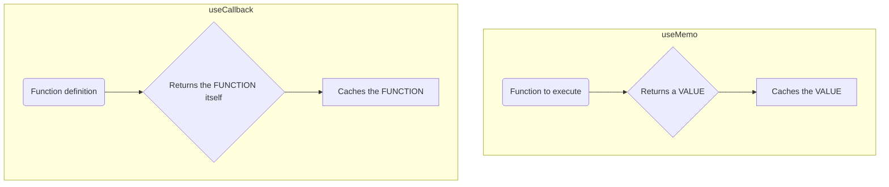

# `useMemo` vs. `useCallback`: The Key Difference! 🔑

Hey! `useMemo` and `useCallback` యొక్క syntax chala similar ga anipinchachu. Rendu oka function theeskuntayi, rendu oka dependency array theeskuntayi. So, what's the difference?

Ee theda chala simple, kani chala important.

## The One-Sentence Answer

*   **`useMemo`** caches a **value** (the *result* of a function).
*   **`useCallback`** caches a **function** itself.

Anthe! Adi main difference.

## Let's Break it Down

### `useMemo` - Caching a Value

`useMemo` lopaala manam pass chese function ni adi **ventane call chesi**, aa function *return chesina value* ni cache cheskuntundi.

```javascript
// `useMemo` caches the `filteredList` array itself.
const filteredList = useMemo(() => {
  // Ee function ventane run avuthundi
  return computeExpensiveList(items);
}, [items]);
```
Ikkada, `filteredList` anedi oka **array** (the value).

**Analogy:** `useMemo` anedi oka chef laantidi. Nuvvu daaniki oka recipe isthav. Adi aa recipe ni use chesi, ventane oka **cake bake chesi (calculates the value)**, aa cake ni fridge lo peduthundi (caches it). Next time nuvvu adiginappudu, dependencies maarakapothe, adi neeku fridge lo unna ade **cake (cached value)** isthundi.

---

### `useCallback` - Caching a Function

`useCallback` lopaala manam pass chese function ni adi **call cheyyadu**. Adi aa function definition ni as it is ga cache cheskuntundi.

```javascript
// `useCallback` caches the `handleClick` function itself.
const handleClick = useCallback(() => {
  // Ee function ippude run avvadu.
  // User click chesinappudu matrame run avuthundi.
  console.log('Button clicked!');
}, []);
```
Ikkada, `handleClick` anedi oka **function**.

**Analogy:** `useCallback` anedi oka chef laantidi. Nuvvu daaniki oka recipe isthav. Adi aa **recipe ni oka book lo raasi (caches the function)**, aa book ni shelf lo peduthundi. Adi ippude cake cheyyadu. Nuvvu "ippudu cheyyi" ani adiginappudu matrame, adi aa book theesi, aa **recipe chusi (calls the function)** cake chesthundi.

## The Secret Relationship

In fact, `useCallback` anedi `useMemo` meeda build chesina oka special hook.

`useCallback(fn, deps)` is equivalent to `useMemo(() => fn, deps)`.

Chusava? `useCallback` anedi oka function (`fn`) ni return chese `useMemo` anthe. React team ee common pattern ni chusi, daaniki `useCallback` ane oka separate, convenient hook ni create chesaru.



Ippudu neeku ee rendu hooks ki madhyalo unna theda clear ga ardham ayyindi anukuntunna.

*   Use **`useMemo`** when you want to cache the result of an expensive calculation.
*   Use **`useCallback`** when you want to cache a function definition to pass it to an optimized child component.

Next, manam `useMemo` ni eppudu vadali, and eppudu vadakudadu aney final guidelines chuddam. Ready? Let's go! 🤔➡️