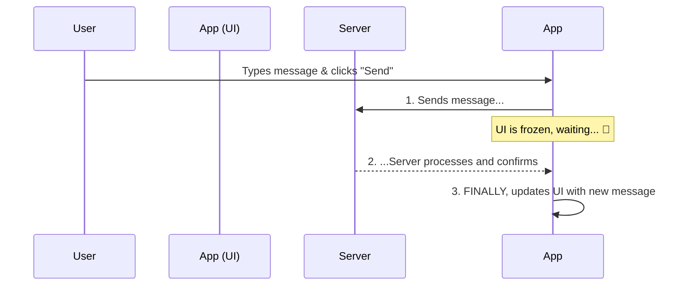

# The Problem: Waiting for the Server... and Waiting... ⏳

Hey friend! Welcome to the `useOptimistic` chapter. Ee hook mana app ni chala fast ga and responsive ga anipinchadaniki create chesaru.

Deenini ardham cheskodaniki, mundu manam oka common UI/UX problem ni chuddam.

## The Slow Chat App Scenario

Imagine chesko, nuvvu oka chat app lo unnav. Nuvvu oka message type chesi "Send" button click chesthav.

Normal ga em jaruguthundi?
1.  **Send Action:** Nuvvu "Send" click cheyagane, nee app aa message ni theeskuni, server ki pampisthundi.
2.  **Waiting:** Server aa message ni theeskuni, database lo save chesi, "Okay, message received" ane confirmation pampinche varaku, nee app wait chesthune untundi. Ee process ki 1-2 seconds pattocchu.
3.  **UI Update:** Server nunchi confirmation vachaka, appudu nee app UI ni update chesi, nee message ni chat list lo chupisthundi.

**The Problem:** Aa 1-2 seconds gap lo, user ki em teliyadu. Vadu "Send" click chesadu, kani screen meeda em maaraledu. "Naa message vellinda? Leda? Internet slow ga unda?" ani confuse avuthadu. The app feels **slow**.

Ee waiting time user experience ni chala debba theesthundi. Modern web applications lo, manam user ki instant feedback ivvali. User action cheyagane, result ventane kanipinchali.

## The Ideal Experience

Ideally, ela undali?
1.  User "Send" click cheyagane, aa message **ventane** chat list lo kanipinchali ( బహుశా konchem "sending..." text tho).
2.  **Background lo,** app aa message ni server ki pampali.
3.  Server nunchi confirmation vachaka, aa "sending..." text ni theeseyyali.

Ee ideal experience ni achieve cheyyadanike, manam **"Optimistic Updates"** ane technique vadatham. And `useOptimistic` hook ee technique ni implement cheyyadaniki create chesina official React tool.

Next, manam asalu "Optimistic Update" ante ento, and `useOptimistic` hook daanini ela handle chesthundo chuddam. Ready to make your app feel instant? Let's go! 🚀➡️