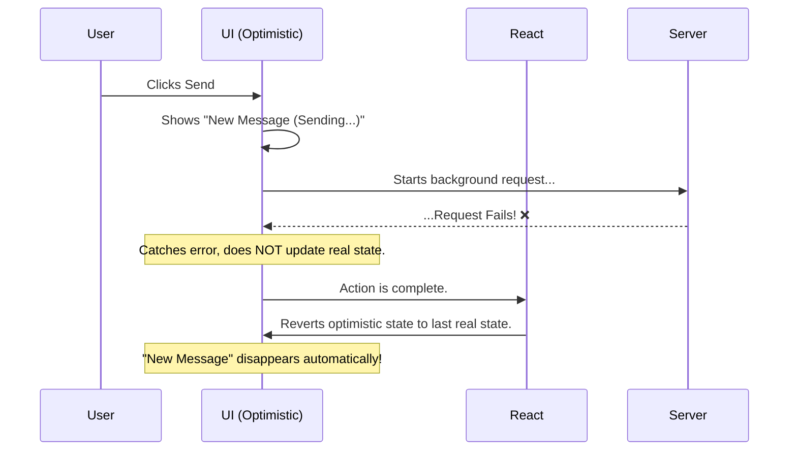

# Handling Failures: The Magic of Automatic Rollback! 🪄

Manam `useOptimistic` tho UI ni ventane ela update cheyyalo chusam. Kani, manam "optimistic" ga unnam, ante manam action success avuthundi ani aashisthunnam.

What if our assumption is wrong? What if the network request fails?

Ikkade `useOptimistic` యొక్క asalu magic undi. **If the real action fails, React automatically rolls back the optimistic update.**

## How Does the Rollback Work?

Gurthu unda? `useOptimistic` anedi rendu states ni track chesthundi:
1.  `state`: The real, confirmed state.
2.  `optimisticState`: The temporary state.

The `optimisticState` is a temporary illusion. React eppudu `state` (the real state) ni "source of truth" ga chusthundi.

**The Flow of a Failure:**
1.  **Optimistic Update:** User clicks "Send". Manam `addOptimistic` ni call chestham. `optimisticState` update avuthundi, and UI lo kotha message "Sending..." tho kanipisthundi.
2.  **Background Action:** The real `sendMessageToServer` function server ki request pampisthundi.
3.  **Failure!** Server nunchi error vasthundi. The `await sendMessageToServer(...)` call throws an error.
4.  **No "Real" State Update:** Error vachindi kabatti, manam `setMessages` (the function that updates the real state) ni call cheyyam. So, the `realMessages` array inka maaraledu.
5.  **React Reverts:** The async action is now complete. React chusthundi, "Okay, action aypoyindi. Real state em maaraledu." So, adi `optimisticState` ni theesesi, daanini malli `realMessages` (the source of truth) ki equal chesthundi.

Result? The temporary "Sending..." message **automatically disappears from the UI!** ✨

## What about Success?

Success case kuda similar ga ne pani chesthundi.
1.  Optimistic update happens.
2.  Background action succeeds.
3.  Ippudu manam `setMessages` ni call chesi, **real state ni** kotha message tho update chestham.
4.  React re-render avuthundi. Ee sari, `useOptimistic` lopaala unna `state` (the real state) lo already kotha message undi. So, `optimisticState` and `state` rendu oke laaga untayi. The "Sending..." label (which was only in the temporary optimistic state) is gone, and the message is now permanent.

Ee automatic rollback feature valla, manam complex logic rayalsina pani ledu. Manam just optimistic update ni add cheyyali, and asalu action ni perform cheyyali. Success or fail, React will make sure the UI ends up in the correct state.

And that's everything you need to know about `useOptimistic`! It’s a powerful tool for making your app feel incredibly fast while handling background actions gracefully.

Next, manam ee concepts anni kalipi, a chat app example ni full, runnable code tho create cheddam! Ready to build? 💻🚀➡️