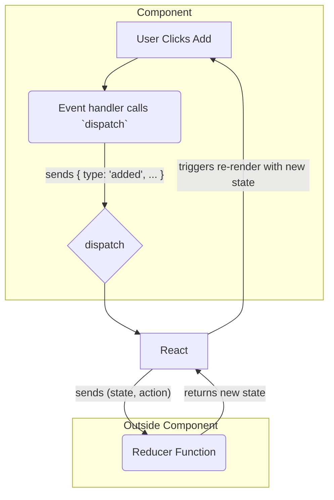

# The Solution: `useReducer` tho State Logic ni Separate Cheyyadam! 分離

Manam `useState` tho complex state logic valla component ela messy ga avuthundo chusam. Ee problem ki React manaki ichina solution eh `useReducer`.

## Asalu `useReducer` ante enti?

`useReducer` anedi `useState` ki oka alternative. Idi manaki **state update logic ni component nunchi bayataki move cheyyadaniki** help chesthundi.

Ee state logic ni manam **"reducer function"** lopaala pedatham.

**Analogy:** Imagine nuvvu oka restaurant owner (the Component).
*   **`useState` way:** Nuvve kitchen loki velli, prathi order ki vantalu chesthu, customers ki serve chesthu, anni panulu nuvve chuskuntunnav. Chala messy!
*   **`useReducer` way:** Nuvvu oka head chef (the Reducer function) ni hire cheskunnav. Ippudu nuvvu kevalam orders (`actions`) theeskuni, chef ki pass chesthav (`dispatch`). Aa chef aa order ni batti vantakam (`new state`) ela cheyyalo chuskuntadu. Nee pani ippudu chala clean!

`useReducer` tho, mana component యొక్క responsibility maaripothundi:
*   **Before:** Component ki state ni *ela* change cheyyalo teliyali.
*   **After:** Component ki kevalam *em* change jaragalo (oka "action") chepthe saripothundi. Aa change ni *ela* cheyyalo aney logic antha reducer chuskuntundi.

## How Does it Solve Our Problem?

`useReducer` tho, mana To-Do list app logic ila maaruthundi:

1.  Manam `handleAddTask`, `handleDeleteTask` lanti logic antha theesesi, oka `todosReducer` aney separate function lopaala pedatham.
2.  Mana component lopaala, manam `useReducer` hook ni call chestham. Adi manaki `todos` (the current state) and `dispatch` (oka special function) ni isthundi.
3.  Ippudu, manam "Add Task" button click chesinappudu, `handleAddTask` lanti function ni call cheyyakunda, manam oka "action" object ni `dispatch` chestham. E.g., `dispatch({ type: 'added', text: 'Learn React' })`.
4.  React ee action ni theeskuni, mana `todosReducer` function ki isthundi.
5.  Reducer aa action (`'added'`) ni chusi, kotha state ni calculate chesi, return chesthundi.
6.  React aa kotha state tho component ni re-render chesthundi.

**Benefits of this approach:**
*   **Clean Components:** Mana component lopaala state update logic undadu. Adi kevalam UI and dispatching actions meeda focus chesthundi. Chala readable ga untundi.
*   **Centralized Logic:** State logic antha oke chota (reducer function) untundi. Debugging and managing chala easy.
*   **Easy Testing:** Manam reducer function ni separate ga, component tho sambandham lekunda test cheyyochu.

Ippudu neeku `useReducer` యొక్క main purpose ardham ayyindi anukuntunna. Idi mana code ni chala organized ga chesthundi.

Next, manam `useReducer` యొక్క moodu mukhyaమైన bhagalu (reducer, state, dispatch) gurinchi inka detail ga chuddam. Ready for the details? Let's go! ➡️