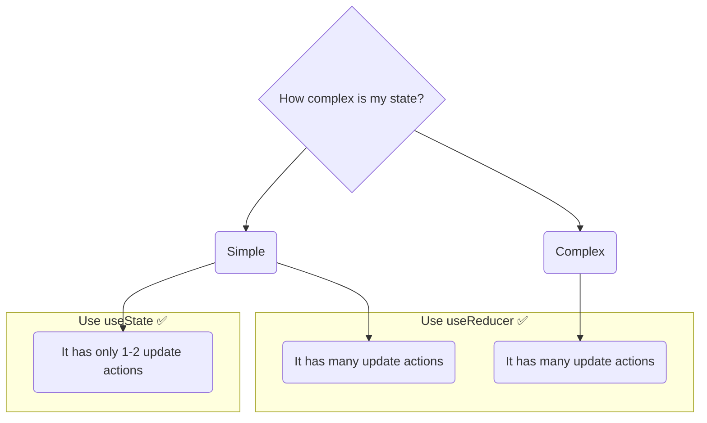

# `useState` vs. `useReducer`: Ee Hook Eppudu Correct? ⚖️

Manaki ippudu state ni manage cheyyadaniki rendu tools unnayi: `useState` and `useReducer`. Rendu oke pani chesthayi, kani vaati approach veru. So, denini eppudu vadali?

## `useState`: The Simple Choice

`useState` anedi simple state kosam perfect.

**Eppudu vadali?**
*   Nee state data type simple ga unnapudu (boolean, number, string).
*   Nee state update logic chala straightforward ga unnapudu.
*   Oka state ki okato rendo update functions matrame unnappudu.
*   Nee state logic vere state meeda depend avvakapothe.

**Example:**
*   Oka modal open/close cheyyadaniki (`const [isOpen, setIsOpen] = useState(false);`).
*   Oka form input value ni store cheyyadaniki (`const [name, setName] = useState('');`).
*   Oka button loading state ni track cheyyadaniki (`const [isLoading, setIsLoading] = useState(false);`).

`useState` code takkuva, and chala easy ga, fast ga rayochu. For simple cases, it's the best choice.

## `useReducer`: The Powerful Choice

`useReducer` anedi complex state logic kosam create chesaru.

**Eppudu vadali?**
*   Nee state oka complex object or array ainappudu.
*   Oka state ki chala different rakalu ga update cheyyalsi vachinappudu (e.g., to-do list lo add, delete, toggle, edit...).
*   Oka state update inko state meeda depend ayyi unnappudu.
*   Nuvvu state update logic ni component nunchi separate chesi, test cheyyali anukunnappudu.

**Example:**
*   Mana To-Do list app.
*   Pedda forms lo chala fields unna state object.
*   Shopping cart state.

`useReducer` konchem ekkuva setup code theeskuntundi (reducer function rayali), kani long run lo, adi nee code ni chala organized ga and maintainable ga chesthundi.

## A Side-by-Side Comparison

| Feature | `useState` | `useReducer` |
| :--- | :--- | :--- |
| **Best For** | Simple state (primitives, simple objects) | Complex state (deeply nested objects, arrays) |
| **Logic** | Update logic component lopaala (event handlers) untundi. | Update logic antha component bayata (reducer function) untundi. |
| **Code Size** | Less boilerplate. Chala concise. | More boilerplate initially. |
| **Readability** | Simple cases lo easy ga untundi. Logic perige koddi, component messy ga avuthundi. | Complex cases lo chala readable ga untundi. Component clean ga untundi. |
| **Testing** | Logic ni test cheyyadaniki component ni render cheyyali. | Reducer function ni separate ga, easy ga test cheyyochu. |

**Final Advice:** Ee rendu hooks lo edhi "better" anedi ledu. Avi veru veru problems ki veru veru solutions. Eeppudu `useState` tho start cheyyi. Nee component state logic complex ga, messy ga avuthundi anipinchinappudu, appudu daanini `useReducer` ki refactor cheyyi.

Ippudu manaki a hook eppudu vadalo full clarity vachindi. Next, manam asalu a "reducer function" ni ela rayalo, daani best practices ento chuddam. Ready to write some logic? Let's go! ✍️➡️