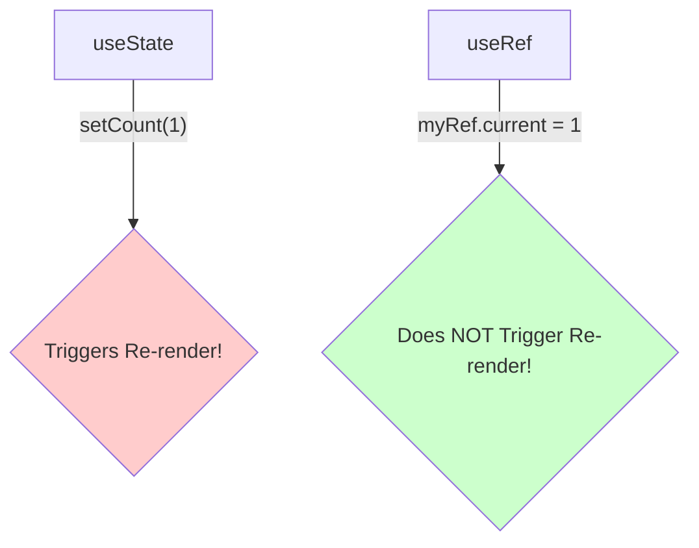

# useRef: A Box for Values That Don't Trigger Renders 📦

Hey friend! Welcome to the `useRef` chapter. Ee hook React lo oka "escape hatch" laantidi. Ante, normal "declarative" React flow nunchi konchem bayataki velli, direct ga konni panulu cheyyadaniki help chesthundi.

## Asalu `useRef` ante enti?

`useRef` anedi oka React Hook. Adi manaki kevalam **oka plain JavaScript object ni** return chesthundi. Ee object eppudu oke laaga untundi, component enni sarlu re-render aina maaradu.

Ee object ki kevalam okate okka property untundi: **`.current`**.

```javascript
import { useRef } from 'react';

function MyComponent() {
  const myRef = useRef(initialValue);
  // myRef lantiది: { current: initialValue }

  // ...
}
```

Nuvvu `myRef.current` property ni read cheyyochu or daaniki kotha value ni assign cheyyochu.

`myRef.current = "some new value";`

## The Superpower: No Re-Renders!

Ikkade `useRef` ki, `useState` ki madhyalo unna pedda theda vasthundi.

*   `useState` tho create chesina state variable ni update cheste (`setState(...)`), adi component ni **re-render** chesthundi.
*   `useRef` యొక్క `.current` property ni update cheste, adi component ni **re-render cheyyadu!** React ki aa change gurinchi asalu teliyadu.

Simple ga cheppalante, `useRef` anedi oka "secret" storage box laantidi. Nuvvu daani lopaala values ni marchina, React adi chudanattu act chesthundi.



## So, deeni valla em upayogam?

Ee "no re-render" behaviour valla, `useRef` ki rendu (2) main use cases unnayi:

1.  **Accessing DOM Nodes:** React prapanchaniki bayata unna DOM ni direct ga access cheyyadaniki. For example, oka `<input>` ni focus cheyyadaniki or oka `<video>` ni play cheyyadaniki.
2.  **Referencing a Value:** Oka value ni re-renders madhyalo "remember" cheskovadaniki, kani aa value maarithe UI update avvalsina avasaram ledu. For example, `setInterval` nunchi vachina timer ID ni store cheskovadaniki.

Ee rendu use cases gurinchi manam ippudu detail ga chuddam. First, let's look at the most common one: accessing DOM nodes. Ready? Let's go! DOM! ➡️