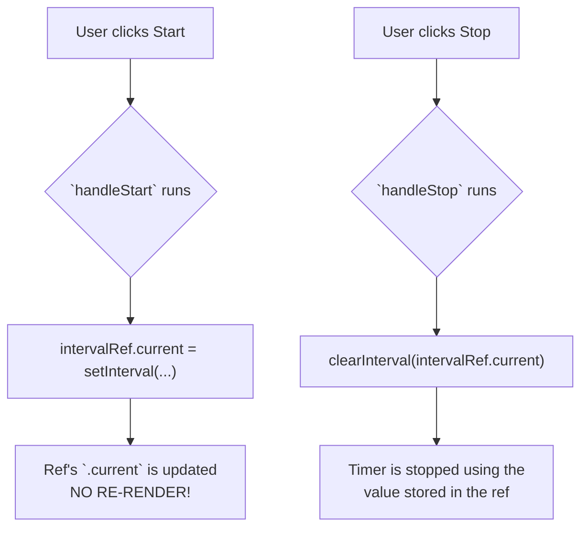

# Use Case 2: Referencing a Value (The Secret Pocket!) 🤫

Manam `useRef` ni DOM nodes kosam vadadam chusam. Kani, deeniki inko super useful power undi: **re-render ni trigger cheyyakunda, oka value ni component re-renders madhyalo "remember" cheskovadam.**

## The Problem: Where to Store a Timer ID?

Imagine chesko, manam oka stopwatch build chesthunnam.
*   "Start" button click cheste, `setInterval` tho oka timer start avvali.
*   "Stop" button click cheste, aa timer ni `clearInterval` tho aapeyyali.

`setInterval` manaki oka `intervalId` (oka number) return chesthundi. Ee `intervalId` ni manam `clearInterval` ki pass cheyyali. So, manam ee `intervalId` ni ekkadaina store cheskovali.

Where do we store it?
*   **A regular variable?** `let intervalId;` No. Component re-render ainappudu, ee variable reset aipothundi.
*   **`useState`?** `const [intervalId, setIntervalId] = useState(null);` Manam deenini vadacchu, kani... `intervalId` maarithe manaki UI lo em update avvalsina avasaram ledu. State ni update cheste, anavasaramaina re-render trigger avuthundi. It's not the right tool for the job.

Manaki oka value kavali, adi:
1.  Re-renders madhyalo persist avvali (regular variable laaga reset avvakudadu).
2.  Daanini update cheste, re-render trigger avvakudadu (`useState` laaga).

Ee rendu conditions ki perfect match eh **`useRef`**.

## The Solution: Store the ID in a Ref

`useRef` anedi oka secret pocket laantidi. Manam daani lopaala em pettina, adi re-renders madhyalo safe ga untundi, and daanini marchina, React ki teliyadu.

```javascript
import { useState, useRef } from 'react';

function Stopwatch() {
  const [time, setTime] = useState(0);

  // 1. Create a ref to hold the interval ID.
  //    Its value will persist across renders.
  const intervalRef = useRef(null);

  function handleStart() {
    // Don't start a new timer if one is already running
    if (intervalRef.current !== null) return;

    // 2. Store the interval ID in the ref's .current property.
    //    This does NOT cause a re-render.
    intervalRef.current = setInterval(() => {
      setTime(t => t + 1);
    }, 1000);
    console.log('Timer started, ID:', intervalRef.current);
  }

  function handleStop() {
    // 3. Read the ID from the ref and clear the interval.
    clearInterval(intervalRef.current);
    intervalRef.current = null; // Reset the ref
    console.log('Timer stopped.');
  }

  return (
    <div>
      <h2>Time: {time}s</h2>
      <button onClick={handleStart}>Start</button>
      <button onClick={handleStop}>Stop</button>
    </div>
  );
}
```
Ee code lo, `intervalRef` anedi mana component ki oka "instance variable" laaga pani chesthundi. Adi re-renders ki survive avuthundi, kani daani change UI ni disturb cheyyadu.



Ippudu neeku `useRef` యొక్క rendu main use cases ardham ayyayi anukuntunna.

Final ga, manam `useState` ki, `useRef` ki madhyalo unna thedalani side-by-side compare cheddam, so neeku eppudu a hook vadalo full clarity vasthundi. Ready for the final comparison? Let's go! 🆚➡️