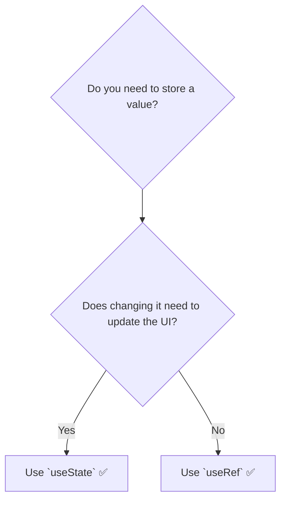

# `useRef` vs. `useState`: Eeppudu Edi Correct? 🆚

Manaki ippudu `useState` and `useRef` rendu telusu. Rendu re-renders madhyalo data ni "remember" cheskuntayi. Kani, vaati madhyalo unna theda chala peddadi and chala important.

## The Golden Rule ✨

Oka simple rule tho start cheddam. Ee rule neeku 99% of the time help chesthundi.

**If the user can see the value on the screen, use `useState`.**
**If the user can't see the value, and it's just for your internal logic, use `useRef`.**

Simple ga, UI lo kanipinche prathi vishayam state avvali. Component lopaala "secret" ga undalsina values refs avvali.

## The Key Differences

Let's break down the differences in a table.

| Feature | `useState` | `useRef` |
| :--- | :--- | :--- |
| **Main Purpose** | To store data that is **displayed in the UI**. | To store data that is **not needed for rendering**. |
| **Updating it...** | `setCount(1)` | `myRef.current = 1` |
| **Effect of Update** | **Triggers a re-render** of the component. | **Does NOT trigger a re-render.** |
| **How to Read** | `count` (direct value) | `myRef.current` (from the `.current` property) |
| **When to Read** | Safe to read during rendering. | **Do not read or write during rendering.** Only in event handlers or effects. |
| **Analogy** | A **blackboard**. Nuvvu daani meeda em rasina, andhariki kanipisthundi. | A **secret notebook**. Nuvvu daani lopaala em rasina, neeku matrame telusu. |

## Let's see it in code

Imagine manam oka component build chesthunnam, adi enni sarlu render ayyindo count cheyyali.

### ❌ The WRONG Way (with `useState`)
```javascript
function RenderCounter() {
  const [renderCount, setRenderCount] = useState(0);

  // PROBLEM! `setRenderCount` oka re-render ni trigger chesthundi.
  // Aa re-render malli ee effect ni trigger chesthundi.
  // This is an INFINITE LOOP! 😱
  useEffect(() => {
    setRenderCount(c => c + 1);
  });

  return <p>I have rendered {renderCount} times.</p>;
}
```
`renderCount` anedi UI lo kanipinchali, kani daanini update cheyyadam valla inko re-render avuthundi. Loop aipoyindi!

### ✅ The RIGHT Way (with `useRef`)
Ee "render count" anedi manam just track cheyyali anukuntunnam, kani daani change valla UI update avvalsina avasaram ledu (for this specific logic).

```javascript
function RenderCounter() {
  const renderCountRef = useRef(0);

  useEffect(() => {
    // Ref ni update cheyyadam re-render ni trigger cheyyadu.
    renderCountRef.current = renderCountRef.current + 1;
    console.log(`Render count: ${renderCountRef.current}`);
  });

  // Note: Manam `renderCountRef.current` ni ikkada JSX lo chupinchamu,
  // endukante adi update aina, UI maaradu.
  return <p>I am a component.</p>;
}
```
Ikkada, manam `renderCountRef` ni component lopaala "secret" ga track chesthunnam. Daani value peruguthu untundi, kani adi anavasaramaina re-renders ni cause cheyyadu.



And that's it! `useState` for what the user sees, `useRef` for what the component knows.

I hope this gives you a crystal clear understanding of these two fundamental hooks.

Next, let's build the code examples to see both use cases of `useRef` in action! 💻✨➡️