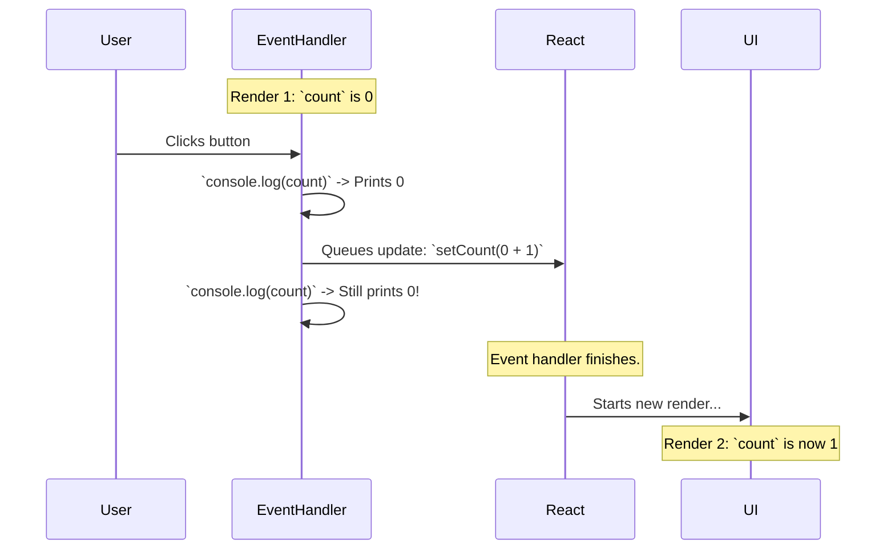

# State as a Snapshot: The "Time Travel" Illusion! 📸

Hey! Manam `setState` function state ni update chesthundi ani cheppukunnam. Kani, adi *eppudu* update chesthundi? Ventane na?

Ee question ki answer "No", and idi `useState` lo atni kante confusing concepts lo okati.

## State is Fixed Within a Render

Oka important vishayam gurthu pettuko: **For any single render, the state is a constant.** Adi aa render antha oke laaga untundi.

**Analogy:** Imagine nuvvu oka photo theesav. Aa photo lo unna manushulu eppatiki ade pose lo untaru. Nuvvu aa photo ni enni sarlu chusina, adi maaradu.

React lo oka render kuda alanti **snapshot** laantidi. Aa render start ainappudu state value ento, aa render antha ade value untundi, even if you call `setState` in the middle.

## `setState` Only Triggers the *Next* Render

Nuvvu `setState` ni call chesinappudu, nuvvu state ni ventane marchatledu. Nuvvu React ki chepthunnav, "Hey React, ee event handler aypoyaka, please ee component ni ee kotha state value tho **re-render cheyyi**."

Let's see an example:

```jsx
function Counter() {
  const [count, setCount] = useState(0);

  function handleClick() {
    console.log(count); // Prints 0

    setCount(count + 1); // Request a re-render with count = 1

    console.log(count); // Still prints 0!
  }

  return <button onClick={handleClick}>Click</button>;
}
```

**Why does it print 0 the second time?**
1.  **First Render:** `count` is `0`.
2.  **User Clicks:** `handleClick` function call avuthundi. Ee function ee first render యొక్క "snapshot" lo undi.
3.  **`console.log(count)`:** Ee snapshot lo `count` value `0`, so adi `0` ni print chesthundi.
4.  **`setCount(count + 1)`:** Nuvvu React ki chepthunnav, "Next render lo, `count` value ni `0 + 1` cheyyi."
5.  **`console.log(count)`:** Kani manam inka pata snapshot lone unnam! So, `count` variable inka `0` eh. Adi malli `0` ne print chesthundi.
6.  **Next Render:** `handleClick` function aypoyaka, React component ni re-render chesthundi. Ee kotha render lo, `useState` manaki `1` ni isthundi.



## What if you call `setState` multiple times?

Ee snapshot behaviour valla, oke event handler lo `setState` ni chala sarlu call cheste emavuthundo chudu:

```jsx
function handleClick() {
  setCount(count + 1); // setCount(0 + 1)
  setCount(count + 1); // setCount(0 + 1)
  setCount(count + 1); // setCount(0 + 1)
}
```
Button click cheste, `count` `3` avvadu. Adi kevalam `1` avuthundi! Endukante, ee calls anni pata `count` (`0`) ni use cheskuntunnayi.

Ee problem ni ela solve cheyyali? Manam state ni previous state meeda base chesi update cheyyali anukunnappudu, manam `setState` ki oka special function ni pass cheyyali. Deeni gurinchi manam next, final section lo chuddam! Ready for the last piece of the `useState` puzzle? Let's go! 🧩➡️