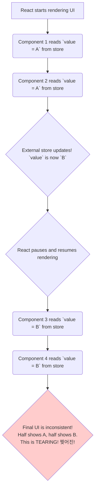

# The Problem: "Tearing" - A Weird Concurrent Bug 찢어진

Manam `useSyncExternalStore` anedi "tearing" aney bug ni solve chesthundi ani cheppukunnam. Asalu entidi ee "tearing"?

Ee bug anedi **Concurrent Rendering** ane React feature valla vasthundi.

## First, What is Concurrent Rendering?

Imagine nuvvu oka artist, pedda painting vesthunnav (rendering a big UI).
*   **Normal Rendering:** Nuvvu painting start cheste, adi complete ayye varaku, nuvvu vere pani em cheyyavu. Madhyalo evaraina pilichina, nuvvu palakavu.
*   **Concurrent Rendering:** Nuvvu painting vesthunnav. Madhyalo nee friend (a high-priority user input) pilichadu anuko, nuvvu painting aapi, friend tho matladi, malli painting continue chesthav.

Concurrent Rendering lo, React oka pedda UI update ni madhyalo aapi, inko urgent update ni handle chesi, malli pata update ni continue cheyyagaladu. Idi app ni chala responsive ga unchuthundi.

## The "Tearing" Problem

Ippudu, manam oka external store (React ki bayata unna data) ki `useEffect` tho subscribe ayyam anukundam.

Concurrent rendering lo emavuthundi?
1.  **Start Render:** React nee UI antha render cheyyadam start chesthundi. Ee time lo, external store lo `value` is `A`. So, konni components `A` tho render avuthayi.
2.  **External Store Changes:** React rendering madhyalo unnappudu, bayata unna store lo `value` `A` nunchi `B` ki maarindi! React ki ee vishayam ippude teliyadu.
3.  **React Pauses & Resumes:** React rendering ni pause chesi, inko pani chesi, malli resume chesthundi anukundam. Ippudu adi migatha components ni render chesthundi. Kani, ee time ki store lo `value` `B` undi! So, ee migatha components `B` tho render avuthayi.

**Result:** Oke render lo, konni components pata data (`A`) tho, inkonni components kotha data (`B`) tho render ayyayi. Screen meeda manaki inconsistent UI kanipisthundi. For example, oka chota username "Jules" ani, inko chota "Jules V" ani kanipinchachu.

Ee phenomenon ne **"tearing"** antaru. The UI is "torn" between two different states.

Ee tearing anedi chala rare and subtle bug, kani state management libraries lantiవి build chesetappudu, idi chala pedda problem. The UI must always be consistent.

Ee tearing problem ni avoid chesi, concurrent rendering lo kuda, UI antha oke, consistent "snapshot" of data ni use chesela cheyyadanike, React `useSyncExternalStore` aney hook ni create chesindi.

Next, manam ee hook ee problem ni ela solve chesthundo chuddam. Ready for the solution? Let's go! ➡️