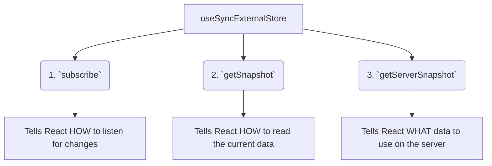

# `useSyncExternalStore` ni Ela Vadali? (The 3 Functions)

Manam `useSyncExternalStore` aney concept ni ardham cheskunnam. Ippudu daani syntax ento, adi ela use cheyyalo chuddam.

## The Basic Syntax

`useSyncExternalStore` anedi oka hook. Adi moodu arguments theeskuntundi.

`const value = useSyncExternalStore(subscribe, getSnapshot, getServerSnapshot?);`

Ee moodu arguments kuda functions eh. Manam ee functions ni create chesi, ee hook ki ivvali. Appudu React వాటిని use cheskuni, external store tho safely connect avuthundi.

Let's break down each function.

### 1. `subscribe(callback)`

*   **Purpose:** Ee function React ki chepthundi, "External store lo data maarithe, neeku ela teliyali?"
*   **Your Job:** Ee function lopaala, nuvvu nee external store యొక్క subscribe method ni call cheyyali. React neeku oka `callback` function isthundi. Nuvvu aa `callback` ni nee store ki pass cheyyali. Store lo data maarina prathi sari, store aa `callback` ni call cheyyali.
*   **Return Value:** Ee `subscribe` function **inko function ni return cheyyali**. Aa return chese function lo, subscription ni cancel chese (unsubscribe) logic undali. Idi cleanup kosam.

```javascript
// Example subscribe function
function subscribe(callback) {
  // Subscribe the callback to the store's changes
  myExternalStore.addListener(callback);

  // Return a cleanup function to unsubscribe
  return () => {
    myExternalStore.removeListener(callback);
  };
}
```

### 2. `getSnapshot()`

*   **Purpose:** Ee function React ki chepthundi, "Store nunchi current data ni ela theeskovali?"
*   **Your Job:** Ee function lopaala, nuvvu nee external store nunchi current data ni theeskuni, daanini return cheyyali.
*   **Important Rule:** Ee function return chese value **immutable** ga undali. Ante, store lo data maarakapothe, ee function prathi sari oke value/reference ni return cheyyali.

```javascript
// Example getSnapshot function
function getSnapshot() {
  return myExternalStore.getValue();
}
```

### 3. `getServerSnapshot()` (Optional)

*   **Purpose:** Idi Server-Side Rendering (SSR) kosam. Server lo HTML generate chesetappudu, browser APIs (like `navigator.onLine`) undavu. So, `getSnapshot` pani cheyyadu.
*   **Your Job:** Ee function lopaala, nuvvu server render kosam కావలసిన initial data ni return cheyyali. For example, `navigator.onLine` ki, server lo eppudu `true` aney default value ivvochu.
*   **Important Rule:** Ee function return chese value, client lo modati render lo `getSnapshot` return chese value tho match avvali (to avoid hydration errors).

```javascript
// Example getServerSnapshot function
function getServerSnapshot() {
  return true; // For navigator.onLine, assume it's true on the server
}
```



And that's it! Ee moodu functions ni correct ga implement cheste, nuvvu a-de-maina external store ni React tho safely and efficiently sync cheyyochu.

Ee hook chala advanced kabatti, and library authors kosam kabatti, manam deeni meeda ekkuva focus cheyyalsina avasaram ledu. But knowing how it works under the hood is a great skill!

Next, manam ee concepts anni kalipi, oka simple conceptual code example create cheddam. Ready to build? 💻✨➡️